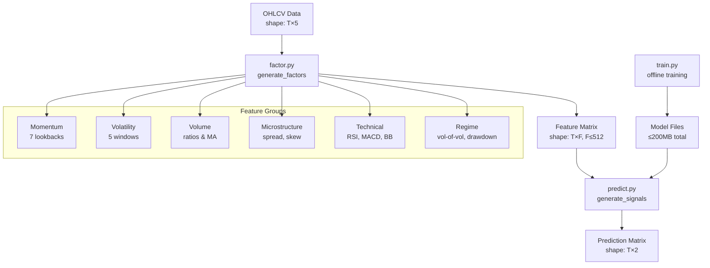
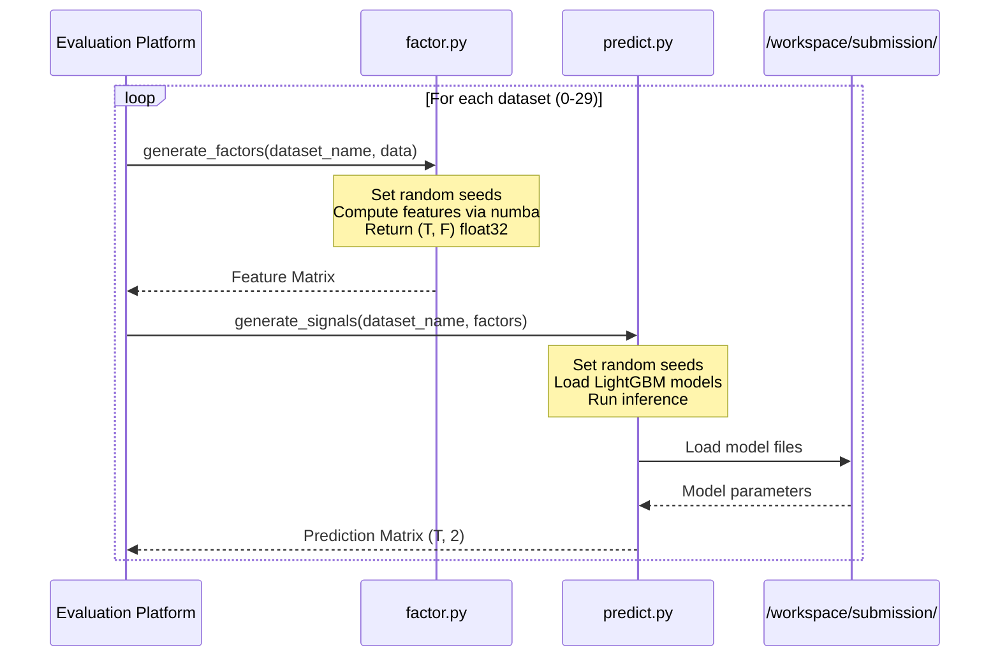

# Design Document: Volatility Return Prediction

## Overview

This system predicts 5-minute (Ret5) and 60-minute (Ret60) forward log returns from 1-minute OHLCV candlestick data for 30 high-volatility financial instruments. The architecture is split into three phases:

1. **Feature Engineering** (`factor.py`) — Computes ~150-200 features per bar using numba-accelerated rolling computations over OHLCV data.
2. **Model Training** (`train.py`) — Trains per-target LightGBM models with temporal cross-validation, producing compact model files.
3. **Signal Generation** (`predict.py`) — Loads pre-trained LightGBM models and produces (T, 2) prediction arrays.

**Key Design Decisions:**
- **LightGBM over PyTorch**: Tabular OHLCV features are best served by gradient-boosted trees. LightGBM handles NaN natively, trains fast, and produces small model files. Neural networks add complexity without clear benefit for this feature set.
- **Numba for feature computation**: With 35M+ total rows across 30 datasets, vectorized numpy alone is too slow. Numba parallel JIT achieves ~15x speedup (benchmarked: 0.18s for 15 features on 2.1M rows).
- **Per-dataset models**: Each dataset represents a different instrument with different dynamics. A single global model would conflate different market microstructures.
- **Mean-reversion as primary signal**: Empirical analysis shows strong negative IC between past momentum and future returns in normal markets (IC ≈ -0.085 for 10-bar momentum vs Ret5), with the signal disappearing in extreme markets.

## Architecture



### Execution Flow



## Components and Interfaces

### 1. Feature Generator (`factor.py`)

**Interface:**
```python
def generate_factors(dataset_name: str, data: np.ndarray) -> np.ndarray:
    """
    Args:
        dataset_name: e.g. "dataset0" through "dataset29"
        data: np.ndarray of shape (T, 5), dtype float32
              columns: [open, high, low, close, volume]
    Returns:
        np.ndarray of shape (T, F), dtype float32, F <= 512
    """
```

**Internal Structure:**
```python
# Pseudocode structure
def generate_factors(dataset_name, data):
    set_seeds(42)
    open_, high, low, close, volume = unpack(data)
    
    features = []
    features += compute_momentum_features(close, LOOKBACKS)      # ~14 features
    features += compute_volatility_features(close, high, low)    # ~20 features
    features += compute_volume_features(volume, close)           # ~15 features
    features += compute_microstructure_features(open_, high, low, close, volume)  # ~20 features
    features += compute_technical_features(close, high, low, volume)  # ~40 features
    features += compute_regime_features(close, volume)           # ~15 features
    features += compute_cross_features(close, volume, high, low) # ~30 features
    
    return np.column_stack(features).astype(np.float32)  # ~154 features
```

**Feature Groups:**

| Group | Count | Description | Lookback Windows |
|-------|-------|-------------|-----------------|
| Momentum | ~14 | Log returns, rate-of-change | 1, 3, 5, 10, 20, 60, 120 |
| Volatility | ~20 | Rolling std, Parkinson, Garman-Klass, ATR | 5, 10, 20, 60, 120 |
| Volume | ~15 | Volume MA ratios, VWAP deviation, OBV | 5, 10, 20, 60 |
| Microstructure | ~20 | Spread proxy, bar return, upper/lower shadow | 5, 10, 20 |
| Technical | ~40 | RSI, MACD, Bollinger, Stochastic, CCI | Multiple |
| Regime | ~15 | Vol-of-vol, drawdown, extreme flag | 20, 60, 120 |
| Cross | ~30 | Momentum×volatility, volume×return interactions | Various |

### 2. Signal Generator (`predict.py`)

**Interface:**
```python
def generate_signals(dataset_name: str, factors: np.ndarray) -> np.ndarray:
    """
    Args:
        dataset_name: e.g. "dataset0" through "dataset29"
        factors: np.ndarray of shape (T, F), dtype float32
    Returns:
        np.ndarray of shape (T, 2), dtype float32
        Column 0: Ret5 prediction signal
        Column 1: Ret60 prediction signal
    """
```

**Internal Structure:**
```python
def generate_signals(dataset_name, factors):
    set_seeds(42)
    MODEL_DIR = Path("/workspace/submission")
    
    # Load models (inside function, not module level)
    model_ret5 = lgb.Booster(model_file=str(MODEL_DIR / f"lgb_ret5_{dataset_name}.txt"))
    model_ret60 = lgb.Booster(model_file=str(MODEL_DIR / f"lgb_ret60_{dataset_name}.txt"))
    
    # Handle NaN: LightGBM handles NaN natively, no imputation needed
    pred_ret5 = model_ret5.predict(factors)
    pred_ret60 = model_ret60.predict(factors)
    
    # Ensure finite output
    signals = np.column_stack([pred_ret5, pred_ret60]).astype(np.float32)
    signals = np.nan_to_num(signals, nan=0.0, posinf=0.0, neginf=0.0)
    return signals
```

### 3. Training Pipeline (`train.py`)

**Interface:**
```python
def train_all_models(data_dir: str, output_dir: str) -> None:
    """
    Trains LightGBM models for all 30 datasets.
    Saves model files to output_dir.
    """
```

**Training Strategy:**
- Per-dataset, per-target models (60 models total: 30 datasets × 2 targets)
- Temporal 80/20 split (first 80% train, last 20% validation)
- Early stopping on validation IC (custom metric)
- Rows with NaN labels excluded from training
- LightGBM handles NaN features natively

### 4. Model Storage Strategy

**Per-dataset models** (preferred approach):
- 30 datasets × 2 targets = 60 LightGBM text files
- Estimated size: ~50KB per model × 60 = ~3MB total (well within 200MB)
- Allows dataset-specific hyperparameters and feature importance

**Alternative: Shared models with dataset embedding** (fallback if per-dataset overfits):
- 2 global models (Ret5, Ret60) trained on all datasets
- Dataset ID encoded as categorical feature
- Smaller total size but less flexibility

## Data Models

### Input Data Schema

```
OHLCV_Data: np.ndarray
  shape: (T, 5)
  dtype: float32
  columns: [open, high, low, close, volume]
  constraints:
    - T varies per dataset (43K to 2.8M rows)
    - Prices are baseline-normalized (typically 0.1 to 3.0 range)
    - Volume varies enormously across datasets
    - Datasets 20-29 may have NaN in OHLCV columns
```

### Feature Matrix Schema

```
Feature_Matrix: np.ndarray
  shape: (T, F) where F ~ 150-200, F <= 512
  dtype: float32
  constraints:
    - First max(lookback_windows) rows contain NaN for lookback-dependent features
    - NaN permitted where computation is undefined
    - All features are causal (use only past/present data)
```

### Prediction Matrix Schema

```
Prediction_Matrix: np.ndarray
  shape: (T, 2)
  dtype: float32
  columns: [ret5_signal, ret60_signal]
  constraints:
    - All values finite (no NaN, no Inf)
    - Non-constant across each dataset
    - 0.0 used as fallback for uncomputable predictions
```

### Model File Schema

```
Model Files:
  Location: /workspace/submission/
  Naming: lgb_ret5_dataset{i}.txt, lgb_ret60_dataset{i}.txt
  Format: LightGBM text model format
  Total size: < 200MB (estimated ~3-10MB total)
```

### LightGBM Hyperparameters

```python
LGB_PARAMS_RET5 = {
    "objective": "regression",
    "metric": "mae",
    "boosting_type": "gbdt",
    "num_leaves": 63,
    "learning_rate": 0.05,
    "feature_fraction": 0.7,
    "bagging_fraction": 0.8,
    "bagging_freq": 5,
    "min_child_samples": 100,
    "lambda_l1": 0.1,
    "lambda_l2": 1.0,
    "max_depth": -1,
    "n_estimators": 500,
    "verbose": -1,
    "seed": 42,
    "deterministic": True,
    "force_row_wise": True,  # Required for deterministic mode
}

LGB_PARAMS_RET60 = {
    **LGB_PARAMS_RET5,
    "num_leaves": 127,       # More capacity for longer horizon
    "n_estimators": 800,
    "learning_rate": 0.03,
}
```

## Correctness Properties

*A property is a characteristic or behavior that should hold true across all valid executions of a system — essentially, a formal statement about what the system should do. Properties serve as the bridge between human-readable specifications and machine-verifiable correctness guarantees.*

### Property 1: Factor Output Contract

*For any* valid OHLCV input array of shape (T, 5) with T ≥ 1 and dtype float32, `generate_factors` shall return an array of shape (T, F) where 1 ≤ F ≤ 512 and dtype is float32.

**Validates: Requirements 1.1, 1.2**

### Property 2: Factor NaN Robustness

*For any* OHLCV input array of shape (T, 5) containing arbitrary NaN placements (including all-NaN rows, all-NaN columns, or random sparse NaN), `generate_factors` shall complete without raising an exception and shall return a float32 array of the correct shape.

**Validates: Requirements 1.3**

### Property 3: Signal Output Contract

*For any* feature matrix of shape (T, F) with T ≥ 1, F ≥ 1, and dtype float32, `generate_signals` shall return an array of shape (T, 2) with dtype float32 containing only finite values (no NaN, no Inf).

**Validates: Requirements 2.1, 11.1, 11.3**

### Property 4: Signal NaN Robustness

*For any* feature matrix of shape (T, F) containing arbitrary NaN placements, `generate_signals` shall complete without raising an exception and shall return a (T, 2) float32 array with all finite values (outputting 0.0 where meaningful prediction is impossible).

**Validates: Requirements 2.3, 11.2**

### Property 5: Factor Determinism

*For any* valid OHLCV input and dataset name, calling `generate_factors` twice (including after module reload) shall produce bit-identical output arrays.

**Validates: Requirements 3.1, 3.3, 4.1, 4.4**

### Property 6: Signal Determinism

*For any* valid feature matrix and dataset name, calling `generate_signals` twice (including after module reload) shall produce bit-identical output arrays.

**Validates: Requirements 3.2, 3.4, 4.2, 4.4**

### Property 7: Factor Causality (No Look-Ahead)

*For any* OHLCV input of length T and any index i where 0 ≤ i < T, the feature vector at index i computed from data[0:T] shall be identical to the feature vector at index i computed from data[0:i+1] (padded or truncated). Equivalently: appending future data beyond index i shall not change the feature at index i.

**Validates: Requirements 5.1, 5.4**

### Property 8: Signal Causality (No Look-Ahead)

*For any* feature matrix of length T and any index i where 0 ≤ i < T, the prediction at index i computed from factors[0:T] shall be identical to the prediction at index i computed from factors[0:i+1].

**Validates: Requirements 5.3**

### Property 9: Lookback NaN Initialization

*For any* OHLCV input and any feature that requires a lookback window of w bars, the feature values at indices 0 through w-2 shall be NaN.

**Validates: Requirements 6.6**

### Property 10: Signal Non-Degeneracy

*For any* feature matrix with at least 100 rows where at least 10% of rows contain non-NaN values with variance > 0, the prediction output shall not be constant-valued (i.e., std(predictions[:, 0]) > 0 and std(predictions[:, 1]) > 0).

**Validates: Requirements 8.3**

## Error Handling

### NaN Handling Strategy

| Component | NaN Source | Strategy |
|-----------|-----------|----------|
| `factor.py` | NaN in OHLCV (datasets 20-29) | Propagate NaN through computations; use `np.nan`-aware functions. Features that cannot be computed produce NaN. |
| `factor.py` | Insufficient lookback at start | Fill with NaN for first `w-1` rows per feature |
| `predict.py` | NaN in feature matrix | LightGBM handles NaN natively (treats as missing, routes to best split) |
| `predict.py` | Model produces NaN/Inf | Replace with 0.0 via `np.nan_to_num` before returning |
| `train.py` | NaN in labels | Exclude rows with NaN labels from training set |
| `train.py` | NaN in features | LightGBM handles natively during training |

### Edge Cases

1. **All-NaN OHLCV row**: Feature computation produces all-NaN feature row → LightGBM predicts using default leaf value → output is finite.
2. **Zero volume**: Volume-based features use `np.where(volume == 0, np.nan, ...)` to avoid division by zero.
3. **Zero price**: Price-based ratios use `np.where(price <= 0, np.nan, np.log(...))` to avoid log(0).
4. **Very short dataset**: If T < max_lookback (120), many features will be NaN for most rows. LightGBM still produces predictions from available features.
5. **Constant price series**: Momentum and volatility features will be 0 or NaN. Model still produces non-degenerate predictions from volume/microstructure features.

### Resource Safety

- **Memory**: Feature computation uses in-place operations where possible. Peak memory ≈ T × F × 4 bytes (float32). For largest dataset (2.8M × 200 features) ≈ 2.2 GB — well within 96 GB.
- **GPU**: Not used (LightGBM CPU inference is fast enough). No GPU OOM risk.
- **Time budget**: Numba-compiled features: ~5s per large dataset. LightGBM inference: ~1s per dataset. Total estimated: < 5 minutes for all 30 datasets.

## Testing Strategy

### Unit Tests (Example-Based)

1. **Interface compliance**: Verify output shapes, dtypes, and value ranges for known inputs.
2. **Feature correctness**: Manually compute expected values for simple inputs (e.g., constant price → zero momentum, linearly increasing price → constant momentum).
3. **Model loading**: Verify models load from correct path and produce predictions.
4. **NaN edge cases**: Test with all-NaN input, single-row input, very short sequences.
5. **Submission package**: Verify file structure, imports, and size constraints.

### Property-Based Tests

**Library**: [Hypothesis](https://hypothesis.readthedocs.io/) (Python property-based testing)

**Configuration**: Minimum 100 iterations per property, with `max_examples=200` for thorough coverage.

Each property test references its design document property:
- Tag format: **Feature: volatility-return-prediction, Property {number}: {property_text}**

**Property tests to implement:**
1. Factor output contract (Property 1)
2. Factor NaN robustness (Property 2)
3. Signal output contract (Property 3)
4. Signal NaN robustness (Property 4)
5. Factor determinism (Property 5)
6. Signal determinism (Property 6)
7. Factor causality (Property 7)
8. Signal causality (Property 8)
9. Lookback NaN initialization (Property 9)
10. Signal non-degeneracy (Property 10)

### Integration Tests

1. **End-to-end pipeline**: Run factor → predict on real training data, compute IC.
2. **Training reproducibility**: Train twice with same seeds, verify identical models.
3. **Performance benchmark**: Time full 30-dataset pipeline, verify < 2 hours.
4. **Cross-validation IC**: Verify positive IC on held-out temporal validation set.

### Validation Metrics

- **Primary**: Mean Pearson IC across 30 datasets, computed separately for:
  - Normal intervals × Ret5
  - Normal intervals × Ret60
  - Extreme intervals × Ret5
  - Extreme intervals × Ret60
- **Secondary**: IC stability (std across datasets), feature importance analysis.
