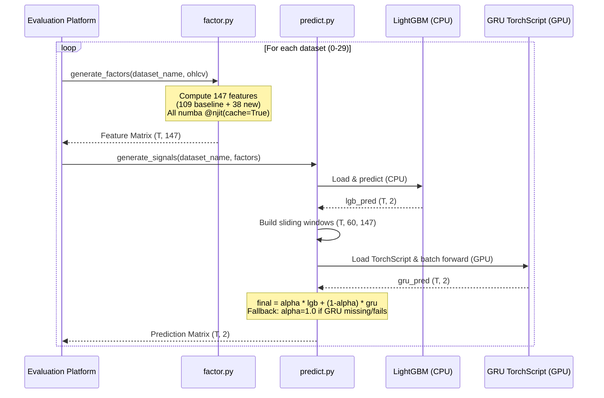
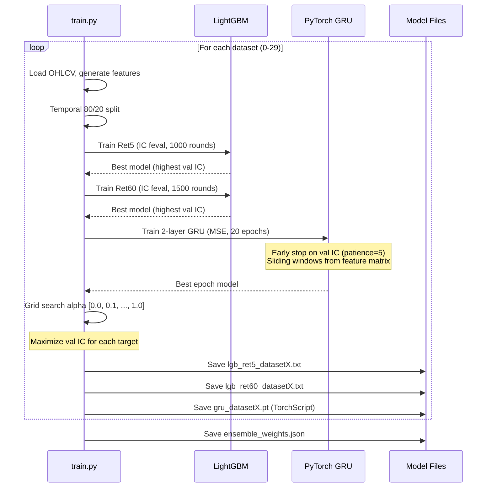

# Design Document: Model Optimization V2

## Overview

This design covers three optimization areas for the existing volatility return prediction system:

1. **LightGBM Training Fix** — Replace MAE-based early stopping with a custom IC feval, increase model capacity, and enable multi-threaded training. This is the highest-impact change: diagnosis shows most models have only 1–30 trees because MAE plateaus before IC is maximized.

2. **Feature Expansion** — Add ~38 new numba-accelerated features (EMA ratios, rolling skewness/kurtosis, close-to-open gaps, volume-weighted returns, return autocorrelation, realized variance) to the existing 109 features, staying within the 512-feature platform limit.

3. **PyTorch GRU Ensemble** — Train a per-dataset 2-layer GRU on 60-bar sliding windows of features, run GPU inference on the RTX 4090, and ensemble with LightGBM via learned per-dataset per-target alpha weights. Safe fallback: alpha=1.0 if GRU doesn't help.

**Design Rationale:**
- The LightGBM fix alone should produce the largest IC gain since models are currently severely undertrained.
- Feature expansion gives the deeper trees more signal to split on, particularly for Ret60 where longer-horizon patterns matter.
- The GRU ensemble captures temporal dependencies (momentum regimes, volatility clustering) that point-in-time tree features cannot, and fully utilizes the idle RTX 4090 GPU on the evaluation platform.

## Architecture

```mermaid
graph TD
    A[OHLCV Data<br/>shape: T×5] --> B[factor.py<br/>generate_factors]
    B --> C[Feature Matrix<br/>shape: T×147, F≤512]
    C --> D[predict.py<br/>generate_signals]
    D --> E[Prediction Matrix<br/>shape: T×2]
    
    subgraph "Model Loading (inside generate_signals)"
        G1[LightGBM Models<br/>60 .txt files] --> D
        G2[GRU TorchScript<br/>30 .pt files] --> D
        G3[ensemble_weights.json] --> D
    end
    
    subgraph "Inference Pipeline"
        D1[LightGBM CPU Inference<br/>point-in-time features]
        D2[Sliding Window Construction<br/>60-bar causal windows]
        D3[GRU GPU Inference<br/>RTX 4090 batch forward]
        D4[Ensemble Blend<br/>alpha * lgb + (1-alpha) * gru]
    end
    
    C --> D1
    C --> D2
    D2 --> D3
    D1 --> D4
    D3 --> D4
    D4 --> E

    subgraph "Training Pipeline (train.py)"
        T1[LightGBM Training<br/>IC feval early stopping]
        T2[GRU Training<br/>MSE loss, IC early stopping]
        T3[Ensemble Weight Optimization<br/>Grid search alpha on val IC]
    end
    
    T1 --> G1
    T2 --> G2
    T3 --> G3
```

### Execution Flow (Inference)



### Training Flow



## Components and Interfaces

### 1. Feature Generator (`factor.py`) — Updated

**Interface (unchanged):**
```python
def generate_factors(dataset_name: str, data: np.ndarray) -> np.ndarray:
    """
    Args:
        dataset_name: e.g. "dataset0" through "dataset29"
        data: np.ndarray of shape (T, 5), dtype float32
              columns: [open, high, low, close, volume]
    Returns:
        np.ndarray of shape (T, F), dtype float32, F <= 512
    """
```

**New Feature Functions (all `@njit(cache=True)`):**

| Function | Features | Description |
|----------|----------|-------------|
| `_compute_ema_ratios(close)` | 5 | `close[i] / EMA(close, span)[i]` for spans [5, 10, 20, 60, 120] |
| `_compute_rolling_skew_kurt(close)` | 6 | Skewness and kurtosis of 1-bar log returns over windows [20, 60, 120] |
| `_compute_close_to_open_gaps(open_, close)` | 7 | Raw gap + rolling mean/std over windows [5, 10, 20] |
| `_compute_volume_weighted_returns(close, volume)` | 8 | Per-bar VWR + rolling sums over windows [5, 10, 20, 60] |
| `_compute_return_autocorrelation(close)` | 4 | Autocorrelation at lags [1, 5] over windows [20, 60] |
| `_compute_realized_variance(close)` | 8 | RV + log-RV over windows [5, 10, 20, 60] |

**Total features:** 109 (baseline) + 5 + 6 + 7 + 8 + 4 + 8 = **147 features** (well within 512 limit)

**Feature Assembly (updated `generate_factors`):**
```python
def generate_factors(dataset_name, data):
    _set_seeds(42)
    open_, high, low, close, volume = unpack(data)
    
    # Existing 109 features (unchanged positions)
    momentum = _compute_momentum_features(...)       # 14
    volatility = _compute_volatility_features(...)   # 20
    vol_feats = _compute_volume_features(...)        # 14
    micro = _compute_microstructure_features(...)    # 14
    tech = _compute_technical_features(...)          # 20
    regime = _compute_regime_features(...)           # 12
    cross = _compute_cross_features(...)             # 15
    
    # New 38 features (appended after baseline)
    ema_ratios = _compute_ema_ratios(close)                          # 5
    skew_kurt = _compute_rolling_skew_kurt(close)                    # 6
    gaps = _compute_close_to_open_gaps(open_, close)                 # 7
    vwr = _compute_volume_weighted_returns(close, volume)            # 8
    autocorr = _compute_return_autocorrelation(close)                # 4
    rv = _compute_realized_variance(close)                           # 8
    
    features = np.column_stack([
        momentum, volatility, vol_feats, micro, tech, regime, cross,
        ema_ratios, skew_kurt, gaps, vwr, autocorr, rv,
    ])
    return features.astype(np.float32)
```

### 2. Signal Generator (`predict.py`) — Updated

**Interface (unchanged):**
```python
def generate_signals(dataset_name: str, factors: np.ndarray) -> np.ndarray:
    """
    Args:
        dataset_name: e.g. "dataset0" through "dataset29"
        factors: np.ndarray of shape (T, F), dtype float32
    Returns:
        np.ndarray of shape (T, 2), dtype float32
        All values finite (no NaN, no Inf).
    """
```

**Updated Internal Structure:**
```python
import torch

MODEL_DIR = Path("/workspace/submission")

def generate_signals(dataset_name, factors):
    _set_seeds(42)
    T, F = factors.shape
    
    # --- LightGBM inference (CPU) ---
    model_ret5 = lgb.Booster(model_file=str(MODEL_DIR / f"lgb_ret5_{dataset_name}.txt"))
    model_ret60 = lgb.Booster(model_file=str(MODEL_DIR / f"lgb_ret60_{dataset_name}.txt"))
    lgb_pred_ret5 = model_ret5.predict(factors)
    lgb_pred_ret60 = model_ret60.predict(factors)
    
    # --- GRU inference (GPU with fallback) ---
    gru_path = MODEL_DIR / f"gru_{dataset_name}.pt"
    weights_path = MODEL_DIR / "ensemble_weights.json"
    
    if gru_path.exists() and weights_path.exists():
        try:
            weights = json.load(open(weights_path))
            ds_weights = weights.get(dataset_name, {"ret5_alpha": 1.0, "ret60_alpha": 1.0})
            alpha_ret5 = ds_weights["ret5_alpha"]
            alpha_ret60 = ds_weights["ret60_alpha"]
            
            if alpha_ret5 < 1.0 or alpha_ret60 < 1.0:
                # Build sliding windows: (T, 60, F)
                windows = build_sliding_windows(factors, window_size=60)
                
                # GPU inference
                device = torch.device("cuda" if torch.cuda.is_available() else "cpu")
                gru_model = torch.jit.load(str(gru_path), map_location=device)
                gru_model.eval()
                
                with torch.no_grad():
                    input_tensor = torch.from_numpy(windows).float().to(device)
                    gru_output = gru_model(input_tensor).cpu().numpy()
                
                gru_pred_ret5 = gru_output[:, 0]
                gru_pred_ret60 = gru_output[:, 1]
                
                # Ensemble
                pred_ret5 = alpha_ret5 * lgb_pred_ret5 + (1 - alpha_ret5) * gru_pred_ret5
                pred_ret60 = alpha_ret60 * lgb_pred_ret60 + (1 - alpha_ret60) * gru_pred_ret60
            else:
                pred_ret5 = lgb_pred_ret5
                pred_ret60 = lgb_pred_ret60
        except Exception:
            # Fallback to pure LightGBM
            pred_ret5 = lgb_pred_ret5
            pred_ret60 = lgb_pred_ret60
    else:
        pred_ret5 = lgb_pred_ret5
        pred_ret60 = lgb_pred_ret60
    
    signals = np.column_stack([pred_ret5, pred_ret60]).astype(np.float32)
    return np.nan_to_num(signals, nan=0.0, posinf=0.0, neginf=0.0)
```

**Sliding Window Construction:**
```python
def build_sliding_windows(factors: np.ndarray, window_size: int = 60) -> np.ndarray:
    """
    Build causal sliding windows for GRU input.
    
    Args:
        factors: (T, F) feature matrix
        window_size: number of bars per window (default 60)
    
    Returns:
        (T, window_size, F) array, zero-padded for early indices
    """
    T, F = factors.shape
    # Replace NaN with 0 for GRU input (GRU cannot handle NaN)
    clean = np.nan_to_num(factors, nan=0.0).astype(np.float32)
    
    # Pad beginning with zeros
    padded = np.zeros((window_size - 1 + T, F), dtype=np.float32)
    padded[window_size - 1:] = clean
    
    # Use stride tricks for efficient window extraction
    windows = np.lib.stride_tricks.sliding_window_view(padded, window_size, axis=0)
    # Shape: (T, F, window_size) → transpose to (T, window_size, F)
    windows = np.moveaxis(windows, -1, 1)
    
    return windows  # (T, 60, F)
```

### 3. Training Pipeline (`train.py`) — Updated

**Key Changes:**

#### A. LightGBM Configuration (Requirements 1–3)

```python
# Updated hyperparameters
LGB_PARAMS_RET5 = {
    "objective": "regression",
    "metric": "None",              # CRITICAL: disable built-in metrics
    "boosting_type": "gbdt",
    "num_leaves": 127,             # Increased from 63
    "learning_rate": 0.03,         # Decreased from 0.05
    "feature_fraction": 0.7,
    "bagging_fraction": 0.8,
    "bagging_freq": 5,
    "min_child_samples": 200,      # Increased from 100
    "lambda_l1": 0.1,
    "lambda_l2": 1.0,
    "max_depth": -1,
    "verbose": -1,
    "seed": 42,
    "num_threads": -1,             # Auto-detect (16 cores)
    # REMOVED: deterministic=True, force_row_wise=True
}

LGB_PARAMS_RET60 = {
    **LGB_PARAMS_RET5,
    "num_leaves": 255,             # Increased from 127
    "learning_rate": 0.02,         # Decreased from 0.03
}

NUM_BOOST_ROUND_RET5 = 1000       # Increased from 500
NUM_BOOST_ROUND_RET60 = 1500      # Increased from 800
EARLY_STOPPING_ROUNDS = 100       # Increased from 50
```

#### B. Custom IC Feval (Requirement 1)

```python
def ic_eval_metric(preds, train_data):
    """
    Custom LightGBM feval: Pearson IC.
    Returns ("ic", ic_value, True) where True = higher is better.
    Handles edge cases: zero variance → IC = 0.0, all-NaN → IC = 0.0.
    """
    labels = train_data.get_label()
    p = np.nan_to_num(preds.astype(np.float64), nan=0.0, posinf=0.0, neginf=0.0)
    y = np.nan_to_num(labels.astype(np.float64), nan=0.0, posinf=0.0, neginf=0.0)
    p = p - p.mean()
    y = y - y.mean()
    denom = np.sqrt((p ** 2).sum() * (y ** 2).sum())
    if denom == 0:
        return "ic", 0.0, True
    return "ic", float((p * y).sum() / denom), True
```

#### C. LightGBM Training Call

```python
model = lgb.train(
    params,                    # metric="None" disables built-in
    train_data,
    num_boost_round=num_boost_round,
    valid_sets=[val_data],
    valid_names=["val"],
    feval=ic_eval_metric,      # Sole early stopping criterion
    callbacks=[
        lgb.early_stopping(stopping_rounds=EARLY_STOPPING_ROUNDS, verbose=False),
        lgb.log_evaluation(period=50),
    ],
)
# model.best_iteration = iteration with highest val IC
```

#### D. PyTorch GRU Model Definition

```python
import torch
import torch.nn as nn

class GRUPredictor(nn.Module):
    def __init__(self, input_size: int, hidden_size: int = 64, num_layers: int = 2):
        super().__init__()
        self.gru = nn.GRU(
            input_size=input_size,
            hidden_size=hidden_size,
            num_layers=num_layers,
            batch_first=True,
            dropout=0.1,
        )
        self.fc = nn.Linear(hidden_size, 2)  # Output: [ret5_pred, ret60_pred]
    
    def forward(self, x: torch.Tensor) -> torch.Tensor:
        # x: (batch, seq_len=60, features)
        _, h_n = self.gru(x)          # h_n: (num_layers, batch, hidden)
        h_last = h_n[-1]              # (batch, hidden) — last layer's final state
        return self.fc(h_last)         # (batch, 2)
```

#### E. GRU Training Loop

```python
def train_gru_model(features, ret5, ret60, train_indices, val_indices, dataset_name):
    """Train GRU model for a single dataset."""
    # Set deterministic CUDA
    os.environ["CUBLAS_WORKSPACE_CONFIG"] = ":4096:8"
    torch.manual_seed(42)
    torch.cuda.manual_seed_all(42)
    torch.use_deterministic_algorithms(True)
    
    F = features.shape[1]
    device = torch.device("cuda" if torch.cuda.is_available() else "cpu")
    
    model = GRUPredictor(input_size=F).to(device)
    optimizer = torch.optim.Adam(model.parameters(), lr=1e-3)
    criterion = nn.MSELoss()
    
    # Build sliding windows for train/val
    train_windows = build_sliding_windows_subset(features, train_indices, window_size=60)
    val_windows = build_sliding_windows_subset(features, val_indices, window_size=60)
    
    train_labels = np.column_stack([ret5[train_indices], ret60[train_indices]])
    val_labels = np.column_stack([ret5[val_indices], ret60[val_indices]])
    
    best_val_ic = -np.inf
    best_state = None
    patience_counter = 0
    
    for epoch in range(20):
        model.train()
        # Mini-batch training
        for batch in dataloader(train_windows, train_labels, batch_size=4096):
            x_batch, y_batch = batch
            x_tensor = torch.from_numpy(x_batch).float().to(device)
            y_tensor = torch.from_numpy(y_batch).float().to(device)
            
            optimizer.zero_grad()
            pred = model(x_tensor)
            loss = criterion(pred, y_tensor)
            loss.backward()
            optimizer.step()
        
        # Validation IC
        model.eval()
        with torch.no_grad():
            val_pred = model(torch.from_numpy(val_windows).float().to(device)).cpu().numpy()
        
        val_ic_ret5 = pearson_ic(val_pred[:, 0], val_labels[:, 0])
        val_ic_ret60 = pearson_ic(val_pred[:, 1], val_labels[:, 1])
        val_ic_mean = (val_ic_ret5 + val_ic_ret60) / 2
        
        if val_ic_mean > best_val_ic:
            best_val_ic = val_ic_mean
            best_state = model.state_dict().copy()
            patience_counter = 0
        else:
            patience_counter += 1
            if patience_counter >= 5:
                break
    
    # Save as TorchScript
    model.load_state_dict(best_state)
    model.eval()
    scripted = torch.jit.script(model)
    scripted.save(f"models/gru_{dataset_name}.pt")
    
    return best_val_ic
```

#### F. Ensemble Weight Optimization

```python
def optimize_ensemble_weights(lgb_val_pred, gru_val_pred, val_labels):
    """
    Grid search over alpha to maximize validation IC.
    Returns (best_alpha_ret5, best_alpha_ret60).
    """
    alphas = np.arange(0.0, 1.1, 0.1)
    
    best_alpha_ret5, best_ic_ret5 = 1.0, -np.inf
    best_alpha_ret60, best_ic_ret60 = 1.0, -np.inf
    
    for alpha in alphas:
        # Ret5
        blended = alpha * lgb_val_pred[:, 0] + (1 - alpha) * gru_val_pred[:, 0]
        ic = pearson_ic(blended, val_labels[:, 0])
        if ic > best_ic_ret5:
            best_ic_ret5 = ic
            best_alpha_ret5 = alpha
        
        # Ret60
        blended = alpha * lgb_val_pred[:, 1] + (1 - alpha) * gru_val_pred[:, 1]
        ic = pearson_ic(blended, val_labels[:, 1])
        if ic > best_ic_ret60:
            best_ic_ret60 = ic
            best_alpha_ret60 = alpha
    
    return best_alpha_ret5, best_alpha_ret60
```

### 4. Model Storage

| Artifact | Count | Est. Size | Format |
|----------|-------|-----------|--------|
| LightGBM models | 60 | 5–20 MB total | `.txt` (LightGBM text format) |
| GRU TorchScript | 30 | 10–30 MB total | `.pt` (TorchScript) |
| Ensemble weights | 1 | <1 KB | `.json` |
| Scripts | 3 | <100 KB | `.py` |
| **Total** | — | **~40–50 MB** | Within 200 MB limit |

## Data Models

### Feature Matrix (Updated)

```
Feature_Matrix: np.ndarray
  shape: (T, 147)
  dtype: float32
  layout:
    columns [0:14]    — Momentum features (unchanged)
    columns [14:34]   — Volatility features (unchanged)
    columns [34:48]   — Volume features (unchanged)
    columns [48:62]   — Microstructure features (unchanged)
    columns [62:82]   — Technical features (unchanged)
    columns [82:94]   — Regime features (unchanged)
    columns [94:109]  — Cross-interaction features (unchanged)
    columns [109:114] — EMA ratios (NEW)
    columns [114:120] — Rolling skewness/kurtosis (NEW)
    columns [120:127] — Close-to-open gaps (NEW)
    columns [127:135] — Volume-weighted returns (NEW)
    columns [135:139] — Return autocorrelation (NEW)
    columns [139:147] — Realized variance (NEW)
  constraints:
    - First max(lookback_windows) rows contain NaN for lookback-dependent features
    - NaN permitted where computation is undefined
    - All features are causal (use only past/present data)
    - Baseline 109 features unchanged in position and computation
```

### LightGBM Hyperparameters (Updated)

```python
# Ret5 target
LGB_PARAMS_RET5 = {
    "objective": "regression",
    "metric": "None",           # Disable built-in metrics
    "boosting_type": "gbdt",
    "num_leaves": 127,          # Was 63
    "learning_rate": 0.03,      # Was 0.05
    "feature_fraction": 0.7,
    "bagging_fraction": 0.8,
    "bagging_freq": 5,
    "min_child_samples": 200,   # Was 100
    "lambda_l1": 0.1,
    "lambda_l2": 1.0,
    "max_depth": -1,
    "verbose": -1,
    "seed": 42,
    "num_threads": -1,          # Multi-threaded (was deterministic single-thread)
}

# Ret60 target
LGB_PARAMS_RET60 = {
    **LGB_PARAMS_RET5,
    "num_leaves": 255,          # Was 127
    "learning_rate": 0.02,      # Was 0.03
}

NUM_BOOST_ROUND_RET5 = 1000    # Was 500
NUM_BOOST_ROUND_RET60 = 1500   # Was 800
EARLY_STOPPING_ROUNDS = 100    # Was 50
```

### GRU Model Architecture

```
GRUPredictor:
  input_size: 147 (F = number of features)
  hidden_size: 64
  num_layers: 2
  dropout: 0.1 (between GRU layers)
  output: Linear(64, 2) → [ret5_pred, ret60_pred]
  
  Parameters: ~100K (lightweight)
  Serialization: TorchScript (.pt)
  Inference: batch forward on GPU, ~2 min per dataset
```

### Ensemble Configuration Schema

```json
{
  "dataset0": {"ret5_alpha": 0.7, "ret60_alpha": 0.5},
  "dataset1": {"ret5_alpha": 1.0, "ret60_alpha": 0.6},
  ...
  "dataset29": {"ret5_alpha": 0.8, "ret60_alpha": 0.4}
}
```

- `alpha = 1.0` → pure LightGBM (GRU disabled for that target)
- `alpha = 0.0` → pure GRU (unlikely in practice)
- Typical expected range: 0.5–0.8 for Ret5, 0.3–0.7 for Ret60

### Sliding Window Schema

```
Sliding_Windows: np.ndarray
  shape: (T, 60, F)
  dtype: float32
  construction:
    - window[i] = factors[max(0, i-59):i+1] (causal)
    - Zero-padded for i < 60
    - NaN replaced with 0.0 before GRU input
  memory: T * 60 * 147 * 4 bytes
    - Largest dataset (2.8M rows): ~99 GB → must use mini-batches
    - Batch size for GPU: 65536 rows → ~2.3 GB per batch (fits in 24GB)
```

### Resource Budget (Inference)

| Stage | Per-Dataset (avg) | 30 Datasets | Notes |
|-------|-------------------|-------------|-------|
| Feature generation | ~4s | ~125s | Numba JIT, 16 cores parallel |
| LightGBM inference | ~0.3s | ~10s | CPU, deterministic |
| Sliding window + GRU GPU | ~32s | ~974s | Batched (65536/batch), RTX 4090 |
| Ensemble + output | ~0.1s | ~3s | Simple arithmetic |
| **Total** | ~37s | **~1109s (18.5 min)** | **Within 2-hour limit (101 min余量)** |


## Correctness Properties

*A property is a characteristic or behavior that should hold true across all valid executions of a system — essentially, a formal statement about what the system should do. Properties serve as the bridge between human-readable specifications and machine-verifiable correctness guarantees.*

### Property 1: IC Feval Correctness

*For any* array of predictions and any array of labels (both of length N ≥ 2), the Custom_IC_Feval function shall return a tuple `("ic", ic_value, True)` where `ic_value` equals the Pearson correlation between the mean-centered predictions and mean-centered labels (with NaN/Inf replaced by 0.0 before computation), and when either array has zero variance, `ic_value` shall be 0.0.

**Validates: Requirements 1.3**

### Property 2: Factor Output Contract

*For any* valid OHLCV input array of shape (T, 5) with T ≥ 1 and dtype float32, `generate_factors` shall return a float32 numpy array of shape (T, F) where 140 ≤ F ≤ 512.

**Validates: Requirements 10.1, 10.2, 11.3**

### Property 3: Factor NaN Robustness

*For any* OHLCV input array of shape (T, 5) containing arbitrary NaN placements (including all-NaN rows, all-NaN columns, or random sparse NaN), `generate_factors` shall complete without raising an exception and shall return a float32 array of shape (T, F).

**Validates: Requirements 14.2**

### Property 4: Factor Causality (No Look-Ahead Bias)

*For any* valid OHLCV input of length T and any index i where 0 ≤ i < T, the feature vector at index i computed from `generate_factors(name, data[0:T])` shall be identical to the feature vector at index i computed from `generate_factors(name, data[0:i+1])`. Appending future data beyond index i shall not change the feature at index i.

**Validates: Requirements 4.4, 12.5, 14.1**

### Property 5: Lookback NaN Initialization

*For any* valid OHLCV input of length T ≥ 200 and any new feature that requires a lookback window of w bars, the feature values at indices 0 through w-2 shall be NaN.

**Validates: Requirements 14.3**

### Property 6: Baseline Feature Preservation

*For any* valid OHLCV input of shape (T, 5), the first 109 columns of the updated `generate_factors` output shall be bit-identical to the output of the original (pre-optimization) `generate_factors` function.

**Validates: Requirements 10.3**

### Property 7: EMA Ratio Computation Correctness

*For any* close price array of length T ≥ 2 with at least one non-NaN value, and for each span in [5, 10, 20, 60, 120], the EMA ratio feature at index i shall equal `close[i] / EMA[i]` where EMA is computed recursively as `EMA[i] = alpha * close[i] + (1 - alpha) * EMA[i-1]` with `alpha = 2 / (span + 1)`, and shall be NaN when EMA[i] is zero or NaN.

**Validates: Requirements 4.1, 4.2, 4.3**

### Property 8: Realized Variance Correctness

*For any* close price array of length T ≥ 61 with non-NaN values, and for each window w in [5, 10, 20, 60], the realized variance feature at index i shall equal the sum of squared 1-bar log returns within the window `[i-w+1, i]`, and the log-RV feature shall equal `log(RV)`.

**Validates: Requirements 9.1, 9.2**

### Property 9: Signal Output Contract

*For any* feature matrix of shape (T, F) with T ≥ 1, F ≥ 1, and dtype float32 (including matrices with arbitrary NaN placements), `generate_signals` shall return a float32 array of shape (T, 2) containing only finite values (no NaN, no Inf).

**Validates: Requirements 11.2, 11.4**

### Property 10: Sliding Window Causality and Shape

*For any* feature matrix of shape (T, F) and window size W=60, the sliding window construction shall produce an array of shape (T, W, F) where: (a) window[i] contains only data from indices max(0, i-W+1) through i, (b) for i < W, the first W-1-i rows of window[i] are zero-padded, and (c) window[i][-1] equals factors[i] (the most recent bar is always the last element).

**Validates: Requirements 18.1, 18.2, 18.3, 18.4**

### Property 11: Ensemble Formula Correctness

*For any* LightGBM prediction array, GRU prediction array (both of shape (T,)), and alpha value in [0.0, 1.0], the ensemble output shall equal `alpha * lgb_pred + (1 - alpha) * gru_pred` element-wise. When alpha=1.0, the output shall be identical to lgb_pred.

**Validates: Requirements 17.3, 17.4**

### Property 12: Grid Search Selects IC-Maximizing Alpha

*For any* pair of prediction arrays (lgb_val_pred, gru_val_pred) and label array, the grid search function shall return the alpha from [0.0, 0.1, ..., 1.0] that produces the highest Pearson IC when blended as `alpha * lgb + (1 - alpha) * gru`. The returned alpha for Ret5 and Ret60 shall be computed independently.

**Validates: Requirements 20.1, 20.2, 20.3**

## Error Handling

### NaN Handling Strategy

| Component | NaN Source | Strategy |
|-----------|-----------|----------|
| `factor.py` (new features) | NaN in OHLCV (datasets 20-29) | Propagate NaN through computations; numba loops check `np.isnan()` before arithmetic |
| `factor.py` (new features) | Insufficient lookback at start | Output NaN for first `w-1` rows per feature |
| `factor.py` (EMA ratios) | EMA denominator is 0 or NaN | Output NaN for that index |
| `predict.py` (sliding windows) | NaN in feature matrix | Replace NaN with 0.0 before GRU input (GRU cannot handle NaN) |
| `predict.py` (GRU) | Model produces NaN/Inf | Caught by final `np.nan_to_num` before return |
| `predict.py` (ensemble) | GRU file missing | Fall back to pure LightGBM (alpha=1.0) |
| `predict.py` (ensemble) | CUDA OOM or error | Catch exception, fall back to LightGBM |
| `train.py` (IC feval) | Zero-variance predictions or labels | Return IC = 0.0 |
| `train.py` (GRU training) | Negative/low validation IC | Save model but set alpha=1.0 in ensemble config |

### GPU Error Recovery

```python
# In predict.py generate_signals():
try:
    device = torch.device("cuda" if torch.cuda.is_available() else "cpu")
    gru_model = torch.jit.load(str(gru_path), map_location=device)
    gru_model.eval()
    with torch.no_grad():
        # Process in batches to avoid OOM
        gru_pred = batch_inference(gru_model, windows, device, batch_size=65536)
except (RuntimeError, torch.cuda.OutOfMemoryError) as e:
    # GPU failed — try CPU
    try:
        gru_model = torch.jit.load(str(gru_path), map_location="cpu")
        gru_model.eval()
        with torch.no_grad():
            gru_pred = batch_inference(gru_model, windows, torch.device("cpu"), batch_size=8192)
    except Exception:
        # CPU also failed — pure LightGBM fallback
        alpha_ret5, alpha_ret60 = 1.0, 1.0
except Exception:
    alpha_ret5, alpha_ret60 = 1.0, 1.0
```

### Memory Management for Large Datasets

The largest dataset has 2.8M rows. Full sliding window tensor would be 2.8M × 60 × 147 × 4 bytes ≈ 99 GB — far exceeds RAM. Solution: **batch construction and inference**.

```python
def batch_inference(model, factors, device, window_size=60, batch_size=65536):
    """Process sliding windows in batches to avoid OOM."""
    T, F = factors.shape
    clean = np.nan_to_num(factors, nan=0.0).astype(np.float32)
    padded = np.zeros((window_size - 1 + T, F), dtype=np.float32)
    padded[window_size - 1:] = clean
    
    predictions = np.empty((T, 2), dtype=np.float32)
    
    for start in range(0, T, batch_size):
        end = min(start + batch_size, T)
        # Build windows for this batch only
        batch_windows = np.zeros((end - start, window_size, F), dtype=np.float32)
        for i in range(start, end):
            batch_windows[i - start] = padded[i:i + window_size]
        
        input_tensor = torch.from_numpy(batch_windows).to(device)
        output = model(input_tensor).cpu().numpy()
        predictions[start:end] = output
    
    return predictions
```

### Edge Cases

| Scenario | Handling |
|----------|----------|
| Dataset with all-NaN OHLCV | All features NaN → LightGBM uses default leaf → GRU gets all-zero windows → ensemble produces finite output |
| GRU .pt file corrupted | `torch.jit.load` raises → caught by try/except → fallback to LightGBM |
| ensemble_weights.json missing | `weights_path.exists()` check fails → pure LightGBM |
| alpha=1.0 for all datasets | GRU inference skipped entirely (optimization: check before loading model) |
| Very short dataset (T < 60) | Sliding windows are fully zero-padded for early indices; GRU still produces output |
| GPU not available | `torch.cuda.is_available()` returns False → CPU inference |

## Testing Strategy

### Unit Tests (Example-Based)

1. **Configuration compliance**: Verify LightGBM params match requirements (metric="None", num_leaves, learning_rate, no deterministic, num_threads).
2. **Feature count**: Verify `generate_factors` produces exactly 147 features for a sample input.
3. **Interface preservation**: Verify function signatures unchanged via `inspect.signature`.
4. **GRU architecture**: Instantiate `GRUPredictor(input_size=147)`, verify output shape is (batch, 2).
5. **TorchScript serialization**: Save and reload a GRU model, verify identical output.
6. **Ensemble config schema**: Verify JSON structure matches expected format.
7. **Fallback behavior**: Test with missing .pt file, missing .json file, and simulated CUDA error.
8. **New feature shapes**: Verify each new feature function returns the expected number of columns.

### Property-Based Tests

**Library**: [Hypothesis](https://hypothesis.readthedocs.io/) (Python property-based testing)

**Configuration**: Minimum 100 iterations per property, `max_examples=200`, `deadline=None` (numba compilation can be slow on first call).

Each property test references its design document property:
- Tag format: **Feature: model-optimization-v2, Property {number}: {property_text}**

**Property tests to implement:**
1. IC feval correctness (Property 1)
2. Factor output contract (Property 2)
3. Factor NaN robustness (Property 3)
4. Factor causality (Property 4)
5. Lookback NaN initialization (Property 5)
6. Baseline feature preservation (Property 6)
7. EMA ratio correctness (Property 7)
8. Realized variance correctness (Property 8)
9. Signal output contract (Property 9)
10. Sliding window causality and shape (Property 10)
11. Ensemble formula correctness (Property 11)
12. Grid search optimality (Property 12)

### Integration Tests

1. **End-to-end IC improvement**: Train with new config, evaluate with `evaluate_local.py`, verify IC > baseline for all 4 categories.
2. **Model tree count regression**: Verify previously-1-tree datasets now have >1 tree.
3. **Training time budget**: Full 30-dataset training completes within reasonable time on 16-core machine.
4. **Inference time budget**: Full 30-dataset inference (factor + predict with ensemble) completes within 2 hours.
5. **Submission size**: Package all artifacts, verify < 200 MB.
6. **GRU training convergence**: Verify at least some datasets achieve positive validation IC with GRU.
7. **Ensemble weight distribution**: Verify ensemble_weights.json contains valid alphas in [0, 1] for all 30 datasets × 2 targets.

### Validation Metrics

- **Primary**: Mean Pearson IC across 30 datasets for:
  - Normal × Ret5 (baseline: 0.1255)
  - Normal × Ret60 (baseline: 0.2519)
  - Extreme × Ret5 (baseline: 0.2673)
  - Extreme × Ret60 (baseline: 0.4316)
- **Secondary**: Per-dataset IC improvement, ensemble alpha distribution, model tree count distribution.
- **Regression check**: No dataset should have IC significantly worse than baseline (> 0.02 drop).
