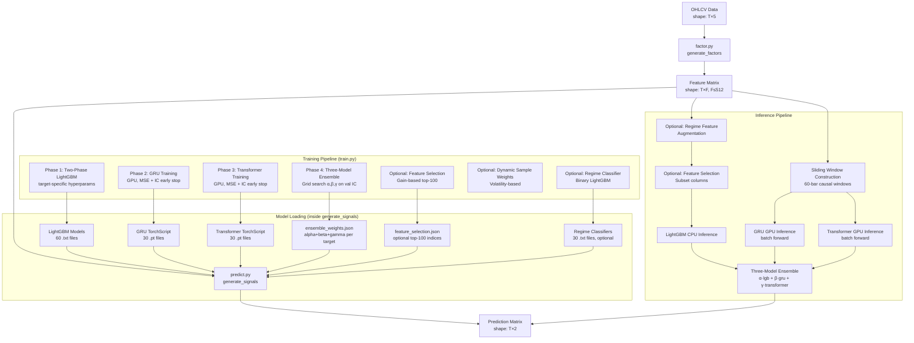
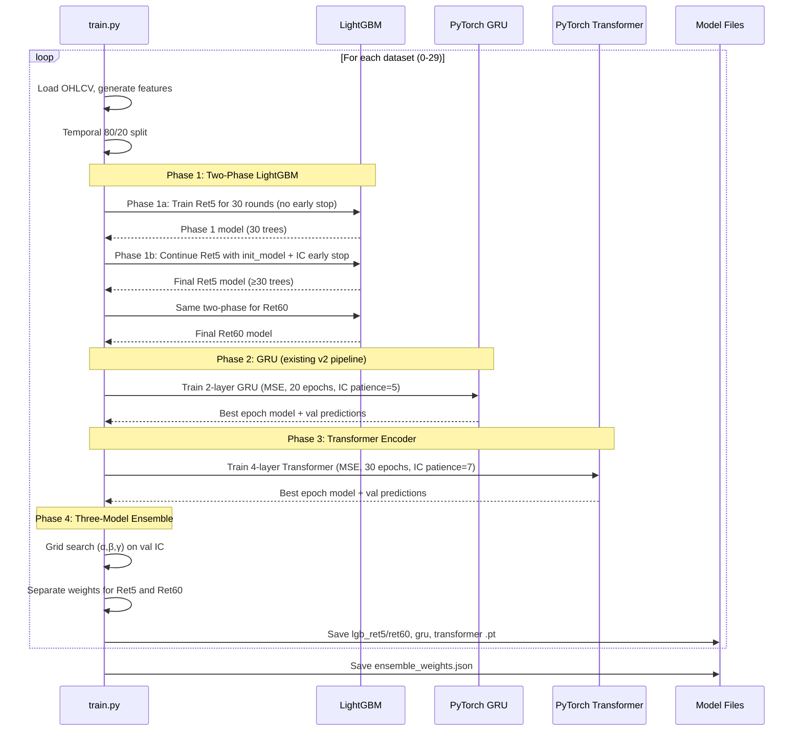
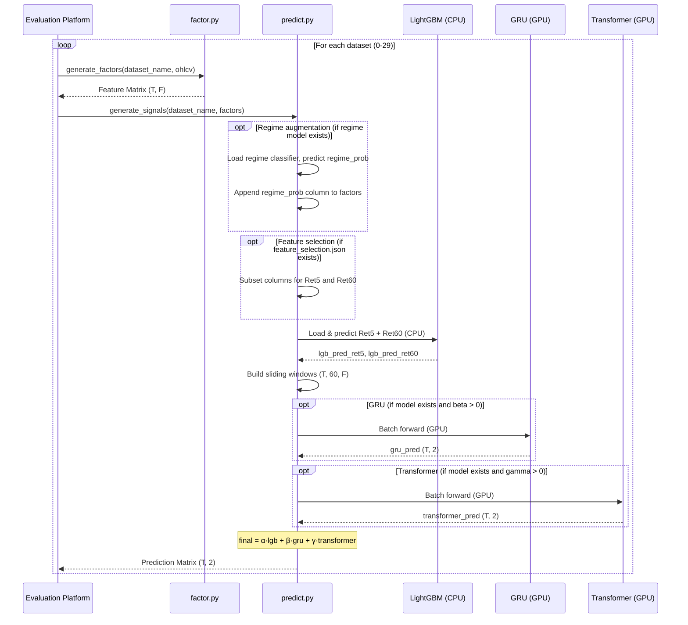

# Design Document: Model Optimization V3

## Overview

This design covers five optimization areas for the volatility return prediction system, building on the v2 baseline (IC: nR5=0.2041, nR60=0.3841, eR5=0.3315, eR60=0.5502). The v2 system uses 60 per-dataset LightGBM models, 30 GRU models (effective for only 4/30 datasets), 147 features, and consumes 106.8 MB / 200 MB with the RTX 4090 GPU almost idle.

**Root causes addressed:**
1. **Ret5 overfitting** — Many datasets converge to 1–5 trees because `num_leaves=127` is too complex for noisy Ret5 targets. Early stopping triggers before the model builds enough trees.
2. **GRU underperformance** — Only 4/30 datasets benefit from GRU due to CPU-only training with subsampling and an architecture too simple for long-range dependencies.
3. **GPU underutilization** — The RTX 4090 remains almost idle; a Transformer encoder can leverage it.
4. **No regime awareness** — The model treats normal and extreme market conditions identically.

**Optimization areas (priority order):**

| Priority | Area | Expected Impact | Status |
|----------|------|-----------------|--------|
| 1 (highest) | LightGBM hyperparameter tuning | Fix Ret5 overfitting, +0.02–0.05 nR5 | Required |
| 2 (high) | Transformer encoder model | GPU-accelerated sequence model for ensemble | Required |
| 3 (optional) | Gain-based feature selection | Remove noisy features, improve generalization | Optional |
| 4 (optional) | Dynamic sample weighting | Volatility-based training weights | Optional |
| 5 (optional) | Regime-aware feature augmentation | Regime probability as extra LightGBM feature | Optional |

**Design rationale:**
- Two-phase LightGBM training with target-specific regularization directly addresses the diagnosed "1-tree problem" for Ret5 — the single highest-impact change.
- The Transformer encoder replaces GRU as the primary sequence model for most datasets, using self-attention to capture long-range dependencies that GRU misses, while fully utilizing the idle RTX 4090.
- Three-model ensemble (LightGBM + GRU + Transformer) with per-dataset per-target grid search automatically selects the best blend, safely falling back to LightGBM-only when neural models don't help.
- Optional areas (feature selection, sample weighting, regime augmentation) provide incremental gains with safe fallbacks.

## Architecture



### Training Flow



### Inference Flow




## Components and Interfaces

### 1. Feature Generator (`factor.py`) — Unchanged

The public interface and feature computation remain identical to v2. No changes to `factor.py` are required for v3.

```python
def generate_factors(dataset_name: str, data: np.ndarray) -> np.ndarray:
    """
    Args:
        dataset_name: e.g. "dataset0" through "dataset29"
        data: np.ndarray of shape (T, 5), dtype float32
              columns: [open, high, low, close, volume]
    Returns:
        np.ndarray of shape (T, 147), dtype float32
    """
```

The existing 147 features (109 baseline + 38 v2 additions) are retained. Feature selection (Requirement 8) operates at the training/inference level by subsetting columns, not by modifying `factor.py`.

### 2. Training Pipeline (`train.py`) — Major Updates

#### 2A. Target-Specific LightGBM Hyperparameters (Req 1)

The key change: Ret5 gets **stronger regularization** to prevent overfitting, while Ret60 gets **higher capacity** for its smoother signal.

```python
# v3 Ret5: stronger regularization to fix overfitting
LGB_PARAMS_RET5_V3 = {
    "objective": "regression",
    "metric": "None",
    "boosting_type": "gbdt",
    "num_leaves": 63,              # Reduced from 127 — simpler trees
    "max_depth": 8,                # NEW: explicit depth limit
    "learning_rate": 0.03,
    "feature_fraction": 0.5,       # Reduced from 0.7 — more regularization
    "bagging_fraction": 0.8,
    "bagging_freq": 5,
    "min_child_samples": 200,
    "lambda_l1": 0.5,              # Increased from 0.1
    "lambda_l2": 5.0,              # Increased from 1.0
    "verbose": -1,
    "seed": 42,
    "num_threads": -1,
}

# v3 Ret60: high capacity (smoother target, less overfitting risk)
LGB_PARAMS_RET60_V3 = {
    "objective": "regression",
    "metric": "None",
    "boosting_type": "gbdt",
    "num_leaves": 255,             # Unchanged from v2
    "max_depth": -1,               # Unlimited depth
    "learning_rate": 0.02,
    "feature_fraction": 0.7,
    "bagging_fraction": 0.8,
    "bagging_freq": 5,
    "min_child_samples": 200,
    "lambda_l1": 0.1,
    "lambda_l2": 1.0,
    "verbose": -1,
    "seed": 42,
    "num_threads": -1,
}
```

#### 2B. Two-Phase LightGBM Training (Req 2)

Two-phase training ensures a minimum of 30 trees before early stopping can trigger. This directly fixes the "1-tree problem" for Ret5.

```python
MIN_BOOST_ROUND = 30  # Minimum trees before early stopping

def train_lgb_two_phase(features, labels, params, max_boost_round,
                         train_data, val_data, min_boost_round=MIN_BOOST_ROUND):
    """
    Two-phase LightGBM training:
      Phase 1: Train for min_boost_round rounds WITHOUT early stopping.
      Phase 2: Continue from Phase 1 model WITH IC-based early stopping.
    """
    # Phase 1: forced minimum rounds, no early stopping
    phase1_model = lgb.train(
        params,
        train_data,
        num_boost_round=min_boost_round,
        valid_sets=[val_data],
        valid_names=["val"],
        feval=ic_eval_metric,
        callbacks=[lgb.log_evaluation(period=50)],
    )

    # Phase 2: continue with early stopping, using init_model
    remaining_rounds = max_boost_round - min_boost_round
    if remaining_rounds <= 0:
        return phase1_model

    phase2_model = lgb.train(
        params,
        train_data,
        num_boost_round=remaining_rounds,
        init_model=phase1_model,          # Resume from Phase 1
        valid_sets=[val_data],
        valid_names=["val"],
        feval=ic_eval_metric,
        callbacks=[
            lgb.early_stopping(stopping_rounds=EARLY_STOPPING_ROUNDS, verbose=False),
            lgb.log_evaluation(period=50),
        ],
    )
    return phase2_model
```

**Design decision:** `init_model` in `lgb.train()` resumes boosting from the Phase 1 model's state. The Phase 2 model inherits all Phase 1 trees and continues adding more. This is the standard LightGBM API for incremental training.

#### 2C. Transformer Encoder Model (Req 3, 4)

```python
class TransformerPredictor(nn.Module):
    """
    4-layer Transformer encoder for sequence-based return prediction.
    Takes sliding windows of features and outputs Ret5 + Ret60 predictions.
    """
    def __init__(self, input_size: int, d_model: int = 64, nhead: int = 4,
                 num_layers: int = 4, dim_feedforward: int = 256,
                 dropout: float = 0.1, max_seq_len: int = 60):
        super().__init__()
        # Linear projection: F features -> d_model
        self.input_proj = nn.Linear(input_size, d_model)

        # Learnable positional encoding
        self.pos_embedding = nn.Parameter(
            torch.randn(1, max_seq_len, d_model) * 0.02
        )

        # Transformer encoder
        encoder_layer = nn.TransformerEncoderLayer(
            d_model=d_model,
            nhead=nhead,
            dim_feedforward=dim_feedforward,
            dropout=dropout,
            batch_first=True,
            norm_first=True,  # Pre-norm for training stability
        )
        self.encoder = nn.TransformerEncoder(
            encoder_layer,
            num_layers=num_layers,
            norm=nn.LayerNorm(d_model),
        )

        # Output head: last position -> 2 predictions
        self.output_head = nn.Linear(d_model, 2)

    def forward(self, x: torch.Tensor) -> torch.Tensor:
        # x: (batch, seq_len=60, F)
        h = self.input_proj(x)                    # (batch, 60, d_model)
        h = h + self.pos_embedding[:, :h.size(1)] # Add positional encoding
        h = self.encoder(h)                        # (batch, 60, d_model)
        h_last = h[:, -1, :]                       # (batch, d_model) — last position
        return self.output_head(h_last)            # (batch, 2)
```

**Architecture decisions:**
- **Learnable positional encoding** (not sinusoidal): With a fixed sequence length of 60, learnable embeddings are simpler and equally effective. The model learns optimal position representations during training.
- **Pre-norm (`norm_first=True`)**: More stable training than post-norm, especially important with only 30 epochs.
- **Last position output**: The last position in the causal window corresponds to the current bar. Using its hidden state for prediction is the natural choice for causal sequence models.
- **`d_model=64, nhead=4`**: Each attention head has dimension 16, which is sufficient for financial time series. Keeping the model small (~200K parameters) prevents overfitting on per-dataset training.

#### 2D. Transformer Training Loop (Req 4)

```python
TRANSFORMER_D_MODEL = 64
TRANSFORMER_NHEAD = 4
TRANSFORMER_NUM_LAYERS = 4
TRANSFORMER_DIM_FF = 256
TRANSFORMER_DROPOUT = 0.1
TRANSFORMER_WINDOW_SIZE = 60
TRANSFORMER_BATCH_SIZE = 4096
TRANSFORMER_LR = 1e-3
TRANSFORMER_EPOCHS = 30
TRANSFORMER_PATIENCE = 7
TRANSFORMER_MIN_IC_THRESHOLD = 0.01

def train_transformer_model(features, ret5, ret60,
                             train_indices, val_indices,
                             dataset_name, output_dir):
    """
    Train a Transformer encoder model for a single dataset.
    Returns (mean_val_ic, val_preds) where val_preds is (N_val, 2).
    """
    # Deterministic seeds
    torch.manual_seed(42)
    if torch.cuda.is_available():
        torch.cuda.manual_seed_all(42)
        os.environ["CUBLAS_WORKSPACE_CONFIG"] = ":4096:8"
        torch.use_deterministic_algorithms(True)

    F = features.shape[1]
    device = _get_best_device()  # CUDA > MPS > CPU

    model = TransformerPredictor(input_size=F).to(device)
    optimizer = torch.optim.Adam(model.parameters(), lr=TRANSFORMER_LR)
    criterion = nn.MSELoss()

    # Build sliding windows (reuse existing infrastructure)
    train_windows = build_sliding_windows_for_indices(features, train_indices)
    val_windows = build_sliding_windows_for_indices(features, val_indices)

    train_labels = np.nan_to_num(
        np.column_stack([ret5[train_indices], ret60[train_indices]]),
        nan=0.0
    ).astype(np.float32)
    val_labels = np.nan_to_num(
        np.column_stack([ret5[val_indices], ret60[val_indices]]),
        nan=0.0
    ).astype(np.float32)

    best_val_ic = -np.inf
    best_state = None
    patience_counter = 0

    for epoch in range(TRANSFORMER_EPOCHS):
        model.train()
        perm = np.random.permutation(len(train_indices))
        epoch_loss = 0.0
        n_batches = 0

        for start in range(0, len(train_indices), TRANSFORMER_BATCH_SIZE):
            end = min(start + TRANSFORMER_BATCH_SIZE, len(train_indices))
            batch_idx = perm[start:end]
            x = torch.from_numpy(train_windows[batch_idx]).to(device)
            y = torch.from_numpy(train_labels[batch_idx]).to(device)

            optimizer.zero_grad()
            pred = model(x)
            loss = criterion(pred, y)
            loss.backward()
            optimizer.step()
            epoch_loss += loss.item()
            n_batches += 1

        # Validation IC
        model.eval()
        val_preds = _batch_predict(model, val_windows, device, TRANSFORMER_BATCH_SIZE)
        ic_r5 = pearson_ic_numpy(val_preds[:, 0], val_labels[:, 0])
        ic_r60 = pearson_ic_numpy(val_preds[:, 1], val_labels[:, 1])
        mean_ic = (ic_r5 + ic_r60) / 2.0

        if mean_ic > best_val_ic:
            best_val_ic = mean_ic
            best_state = {k: v.clone() for k, v in model.state_dict().items()}
            patience_counter = 0
        else:
            patience_counter += 1
            if patience_counter >= TRANSFORMER_PATIENCE:
                break

    # Save as TorchScript (CPU for portability)
    if best_state is not None:
        model.load_state_dict(best_state)
    model = model.cpu()
    model.eval()
    dummy = torch.zeros(1, TRANSFORMER_WINDOW_SIZE, F)
    traced = torch.jit.trace(model, dummy)
    traced.save(os.path.join(output_dir, f"transformer_{dataset_name}.pt"))

    return best_val_ic, val_preds
```

#### 2E. Three-Model Ensemble Weight Optimization (Req 6)

```python
def optimize_three_model_ensemble(lgb_val_r5, lgb_val_r60,
                                   gru_val_r5, gru_val_r60,
                                   tf_val_r5, tf_val_r60,
                                   val_r5_labels, val_r60_labels,
                                   gru_enabled=True, tf_enabled=True):
    """
    Grid search over (alpha, beta, gamma) triples where alpha+beta+gamma=1.0.
    Each value in {0.0, 0.1, 0.2, ..., 1.0}. Step size 0.1 gives 66 valid triples.

    Returns dict: {
        "ret5_alpha": float, "ret5_beta": float, "ret5_gamma": float,
        "ret60_alpha": float, "ret60_beta": float, "ret60_gamma": float,
    }
    """
    step = 0.1
    values = np.arange(0.0, 1.0 + step/2, step)

    # Generate all valid (a, b, g) triples
    triples = []
    for a in values:
        for b in values:
            g = 1.0 - a - b
            if g >= -1e-9 and g <= 1.0 + 1e-9:
                g = max(0.0, min(1.0, g))  # Clamp floating point
                if not gru_enabled and b > 0:
                    continue
                if not tf_enabled and g > 0:
                    continue
                triples.append((round(a, 1), round(b, 1), round(g, 1)))

    best = {}
    for target, lgb_pred, gru_pred, tf_pred, labels in [
        ("ret5", lgb_val_r5, gru_val_r5, tf_val_r5, val_r5_labels),
        ("ret60", lgb_val_r60, gru_val_r60, tf_val_r60, val_r60_labels),
    ]:
        best_ic = -np.inf
        best_triple = (1.0, 0.0, 0.0)
        for a, b, g in triples:
            blended = a * lgb_pred + b * gru_pred + g * tf_pred
            ic = pearson_ic_numpy(blended, labels)
            if ic > best_ic:
                best_ic = ic
                best_triple = (a, b, g)
        best[f"{target}_alpha"] = best_triple[0]
        best[f"{target}_beta"] = best_triple[1]
        best[f"{target}_gamma"] = best_triple[2]

    return best
```

**Design decision:** With step=0.1, there are exactly 66 valid triples where `a+b+g=1.0`. This is computationally trivial (66 × 2 IC computations per dataset = 132 evaluations). No need for scipy optimization.

#### 2F. Feature Importance Extraction and Selection (Req 7, 8 — Optional)

```python
def extract_feature_importance(models_ret5, models_ret60, num_features):
    """
    Aggregate gain-based feature importance across all 30 datasets per target.
    Returns (ret5_top100_indices, ret60_top100_indices).
    """
    ret5_gain = np.zeros(num_features)
    ret60_gain = np.zeros(num_features)

    for model in models_ret5:
        importance = model.feature_importance(importance_type="gain")
        ret5_gain += importance

    for model in models_ret60:
        importance = model.feature_importance(importance_type="gain")
        ret60_gain += importance

    ret5_top100 = np.argsort(ret5_gain)[-100:][::-1].tolist()
    ret60_top100 = np.argsort(ret60_gain)[-100:][::-1].tolist()

    return ret5_top100, ret60_top100
```

#### 2G. Dynamic Sample Weighting (Req 9 — Optional)

```python
def compute_dynamic_sample_weights(close_prices, window_vol=20, window_median=120):
    """
    Compute volatility-based sample weights.
    weight[i] = 1.0 + 0.5 * (volatility[i] / rolling_vol_median[i])
    All computations are causal (no look-ahead).
    """
    T = len(close_prices)
    log_returns = np.diff(np.log(close_prices + 1e-10))
    log_returns = np.concatenate([[0.0], log_returns])

    # Rolling std of log returns (causal)
    volatility = np.full(T, np.nan)
    for i in range(window_vol - 1, T):
        volatility[i] = np.std(log_returns[i - window_vol + 1:i + 1])

    # Rolling median of volatility (causal)
    rolling_median = np.full(T, np.nan)
    for i in range(window_median - 1, T):
        rolling_median[i] = np.median(volatility[max(0, i - window_median + 1):i + 1])

    # Compute weights
    weights = np.ones(T, dtype=np.float32)
    valid = (~np.isnan(volatility)) & (~np.isnan(rolling_median)) & (rolling_median > 0)
    weights[valid] = 1.0 + 0.5 * (volatility[valid] / rolling_median[valid])

    return weights
```

#### 2H. Regime Classifier (Req 10 — Optional)

```python
REGIME_PARAMS = {
    "objective": "binary",
    "metric": "binary_logloss",
    "num_leaves": 31,
    "max_depth": 6,
    "n_estimators": 200,
    "learning_rate": 0.05,
    "verbose": -1,
    "seed": 42,
    "num_threads": -1,
}

# Regime-related feature indices from factor.py (columns 82-93: regime features)
REGIME_FEATURE_INDICES = list(range(82, 94))  # 12 regime features

def train_regime_classifier(features, indices, extreme_intervals, dataset_name, output_dir):
    """
    Train a lightweight binary classifier to predict extreme regime probability.
    Labels: 1 if bar is within extreme_intervals, 0 otherwise.
    """
    # Build binary labels from extreme_intervals
    labels = build_extreme_mask(indices, extreme_intervals).astype(np.float32)

    # Use only regime-related features
    X = features[:, REGIME_FEATURE_INDICES]

    # Temporal split
    T = len(labels)
    split = int(T * 0.8)
    train_data = lgb.Dataset(X[:split], label=labels[:split])
    val_data = lgb.Dataset(X[split:], label=labels[split:], reference=train_data)

    model = lgb.train(
        REGIME_PARAMS,
        train_data,
        num_boost_round=200,
        valid_sets=[val_data],
        callbacks=[lgb.early_stopping(stopping_rounds=30, verbose=False)],
    )

    model.save_model(os.path.join(output_dir, f"regime_{dataset_name}.txt"))
    return model
```

### 3. Signal Generator (`predict.py`) — Major Updates

**Interface (unchanged):**
```python
def generate_signals(dataset_name: str, factors: np.ndarray) -> np.ndarray:
    """
    Args:
        dataset_name: e.g. "dataset0" through "dataset29"
        factors: np.ndarray of shape (T, F), dtype float32
    Returns:
        np.ndarray of shape (T, 2), dtype float32, all finite
    """
```

**Updated internal structure:**

```python
def generate_signals(dataset_name, factors):
    _set_seeds(42)
    T, F = factors.shape

    # --- Optional: Regime feature augmentation ---
    regime_path = MODEL_DIR / f"regime_{dataset_name}.txt"
    if regime_path.exists():
        regime_model = lgb.Booster(model_file=str(regime_path))
        regime_features = factors[:, 82:94]  # Regime feature subset
        regime_prob = regime_model.predict(regime_features).astype(np.float32)
        factors_augmented = np.column_stack([factors, regime_prob])
    else:
        factors_augmented = factors

    # --- Optional: Feature selection ---
    fs_path = MODEL_DIR / "feature_selection.json"
    if fs_path.exists():
        with open(fs_path) as f:
            fs = json.load(f)
        ret5_indices = fs["ret5_features"]
        ret60_indices = fs["ret60_features"]
        factors_ret5 = factors_augmented[:, ret5_indices]
        factors_ret60 = factors_augmented[:, ret60_indices]
    else:
        factors_ret5 = factors_augmented
        factors_ret60 = factors_augmented

    # --- LightGBM inference (CPU) ---
    model_ret5 = lgb.Booster(model_file=str(MODEL_DIR / f"lgb_ret5_{dataset_name}.txt"))
    model_ret60 = lgb.Booster(model_file=str(MODEL_DIR / f"lgb_ret60_{dataset_name}.txt"))
    lgb_pred_ret5 = model_ret5.predict(factors_ret5)
    lgb_pred_ret60 = model_ret60.predict(factors_ret60)

    # --- Default: pure LightGBM ---
    pred_ret5 = lgb_pred_ret5
    pred_ret60 = lgb_pred_ret60

    # --- Load ensemble weights ---
    weights_path = MODEL_DIR / "ensemble_weights.json"
    if not weights_path.exists():
        signals = np.column_stack([pred_ret5, pred_ret60]).astype(np.float32)
        return np.nan_to_num(signals, nan=0.0, posinf=0.0, neginf=0.0)

    with open(weights_path) as wf:
        all_weights = json.load(wf)
    ds_w = all_weights.get(dataset_name, {})
    alpha_r5 = float(ds_w.get("ret5_alpha", 1.0))
    beta_r5 = float(ds_w.get("ret5_beta", 0.0))
    gamma_r5 = float(ds_w.get("ret5_gamma", 0.0))
    alpha_r60 = float(ds_w.get("ret60_alpha", 1.0))
    beta_r60 = float(ds_w.get("ret60_beta", 0.0))
    gamma_r60 = float(ds_w.get("ret60_gamma", 0.0))

    need_gru = (beta_r5 > 0 or beta_r60 > 0)
    need_transformer = (gamma_r5 > 0 or gamma_r60 > 0)

    if not need_gru and not need_transformer:
        signals = np.column_stack([pred_ret5, pred_ret60]).astype(np.float32)
        return np.nan_to_num(signals, nan=0.0, posinf=0.0, neginf=0.0)

    # --- Build sliding windows (shared by GRU and Transformer) ---
    import torch
    clean = np.nan_to_num(factors, nan=0.0).astype(np.float32)
    padded = np.zeros((GRU_WINDOW_SIZE - 1 + T, F), dtype=np.float32)
    padded[GRU_WINDOW_SIZE - 1:] = clean

    device = _get_device()  # CUDA > MPS > CPU

    gru_pred = np.zeros((T, 2), dtype=np.float32)
    tf_pred = np.zeros((T, 2), dtype=np.float32)

    # --- GRU inference ---
    if need_gru:
        gru_pred = _run_sequence_model(
            MODEL_DIR / f"gru_{dataset_name}.pt", padded, T, F, device
        )

    # --- Transformer inference ---
    if need_transformer:
        tf_pred = _run_sequence_model(
            MODEL_DIR / f"transformer_{dataset_name}.pt", padded, T, F, device
        )

    # --- Three-model ensemble ---
    pred_ret5 = alpha_r5 * lgb_pred_ret5 + beta_r5 * gru_pred[:, 0] + gamma_r5 * tf_pred[:, 0]
    pred_ret60 = alpha_r60 * lgb_pred_ret60 + beta_r60 * gru_pred[:, 1] + gamma_r60 * tf_pred[:, 1]

    signals = np.column_stack([pred_ret5, pred_ret60]).astype(np.float32)
    return np.nan_to_num(signals, nan=0.0, posinf=0.0, neginf=0.0)


def _run_sequence_model(model_path, padded, T, F, device):
    """Run batched inference for a TorchScript sequence model (GRU or Transformer)."""
    import torch
    if not model_path.exists():
        return np.zeros((T, 2), dtype=np.float32)
    try:
        model = torch.jit.load(str(model_path), map_location=device)
        model.eval()
        pred = np.empty((T, 2), dtype=np.float32)
        with torch.no_grad():
            for start in range(0, T, GRU_BATCH_SIZE):
                end = min(start + GRU_BATCH_SIZE, T)
                batch = _build_sliding_windows_batched(None, start, end, padded, GRU_WINDOW_SIZE)
                try:
                    inp = torch.from_numpy(batch).to(device)
                    out = model(inp).cpu().numpy()
                except RuntimeError:
                    inp = torch.from_numpy(batch)
                    out = model.cpu()(inp).numpy()
                pred[start:end] = out
        return pred
    except Exception:
        return np.zeros((T, 2), dtype=np.float32)
```

### 4. Model Storage Budget

| Artifact | Count | Est. Size | Format |
|----------|-------|-----------|--------|
| LightGBM models (Ret5+Ret60) | 60 | 5–20 MB | `.txt` |
| GRU TorchScript | 30 | 10–30 MB | `.pt` |
| Transformer TorchScript | 30 | 15–40 MB | `.pt` |
| Regime classifiers (optional) | 30 | 2–5 MB | `.txt` |
| ensemble_weights.json | 1 | <1 KB | `.json` |
| feature_selection.json (optional) | 1 | <1 KB | `.json` |
| Scripts | 3 | <100 KB | `.py` |
| **Total** | — | **~35–95 MB** | Within 200 MB |

Transformer models are small (~200K params × 4 bytes = ~800 KB per model, ~24 MB for 30 models). Combined with existing LightGBM and GRU models, total stays well under 200 MB.


## Data Models

### Feature Matrix

```
Feature_Matrix: np.ndarray
  shape: (T, 147) — unchanged from v2
  dtype: float32
  layout:
    columns [0:14]    — Momentum features
    columns [14:34]   — Volatility features
    columns [34:48]   — Volume features
    columns [48:62]   — Microstructure features
    columns [62:82]   — Technical features
    columns [82:94]   — Regime features
    columns [94:109]  — Cross-interaction features
    columns [109:114] — EMA ratios (v2)
    columns [114:120] — Rolling skewness/kurtosis (v2)
    columns [120:127] — Close-to-open gaps (v2)
    columns [127:135] — Volume-weighted returns (v2)
    columns [135:139] — Return autocorrelation (v2)
    columns [139:147] — Realized variance (v2)
  constraints:
    - All features are causal (no look-ahead bias)
    - NaN permitted where computation is undefined
    - F ≤ 512 (platform limit)
```

### Augmented Feature Matrix (with Regime Probability)

```
Augmented_Feature_Matrix: np.ndarray
  shape: (T, 148) — original 147 + 1 regime_prob column
  dtype: float32
  layout:
    columns [0:147]  — Original Feature_Matrix
    column [147]     — Regime_Probability ∈ [0.0, 1.0]
  constraints:
    - Only created when regime_{dataset_name}.txt exists
    - Regime_Probability is causal (uses only features at indices 0..i)
    - Falls back to (T, 147) when regime model is missing
```

### LightGBM Hyperparameters (v3)

```python
# Ret5: stronger regularization (fixes overfitting)
LGB_PARAMS_RET5_V3 = {
    "num_leaves": 63,        # v2: 127
    "max_depth": 8,          # v2: -1 (unlimited)
    "lambda_l1": 0.5,        # v2: 0.1
    "lambda_l2": 5.0,        # v2: 1.0
    "feature_fraction": 0.5, # v2: 0.7
    "learning_rate": 0.03,
    "min_child_samples": 200,
}

# Ret60: high capacity (unchanged philosophy)
LGB_PARAMS_RET60_V3 = {
    "num_leaves": 255,       # v2: 255 (unchanged)
    "max_depth": -1,         # Unlimited
    "lambda_l1": 0.1,
    "lambda_l2": 1.0,
    "feature_fraction": 0.7,
    "learning_rate": 0.02,
    "min_child_samples": 200,
}

# Two-phase training
MIN_BOOST_ROUND = 30         # Phase 1: forced minimum
NUM_BOOST_ROUND_RET5 = 1000  # Phase 2 max
NUM_BOOST_ROUND_RET60 = 1500
EARLY_STOPPING_ROUNDS = 100
```

### Transformer Model Architecture

```
TransformerPredictor:
  input_proj: Linear(F, 64)           — Project features to d_model
  pos_embedding: Parameter(1, 60, 64) — Learnable positional encoding
  encoder: TransformerEncoder(
    layer: TransformerEncoderLayer(
      d_model=64, nhead=4, dim_feedforward=256,
      dropout=0.1, batch_first=True, norm_first=True
    ),
    num_layers=4,
    norm=LayerNorm(64)
  )
  output_head: Linear(64, 2)          — [ret5_pred, ret60_pred]

  Parameters: ~200K (lightweight, ~800 KB per model file)
  Serialization: TorchScript via torch.jit.trace()
  Training: MSE loss, Adam lr=1e-3, 30 epochs, patience=7
  Inference: GPU batch forward, batch_size=65536
```

### GRU Model Architecture (unchanged from v2)

```
GRUPredictor:
  gru: GRU(input_size=F, hidden_size=64, num_layers=2, dropout=0.1)
  fc: Linear(64, 2)

  Parameters: ~100K
  Serialization: TorchScript via torch.jit.trace()
  Training: MSE loss, Adam lr=1e-3, 20 epochs, patience=5
```

### Three-Model Ensemble Configuration Schema

```json
{
  "dataset0": {
    "ret5_alpha": 0.6, "ret5_beta": 0.1, "ret5_gamma": 0.3,
    "ret60_alpha": 0.4, "ret60_beta": 0.2, "ret60_gamma": 0.4
  },
  "dataset1": {
    "ret5_alpha": 1.0, "ret5_beta": 0.0, "ret5_gamma": 0.0,
    "ret60_alpha": 0.5, "ret60_beta": 0.0, "ret60_gamma": 0.5
  }
}
```

- `alpha + beta + gamma = 1.0` for each target
- `alpha=1.0, beta=0.0, gamma=0.0` → pure LightGBM (neural models disabled)
- Grid search step=0.1 → 66 valid triples per target
- Separate weights for Ret5 and Ret60

### Feature Selection Configuration Schema (Optional)

```json
{
  "ret5_features": [3, 7, 12, 15, 82, 83, ...],
  "ret60_features": [1, 5, 9, 14, 34, 62, ...]
}
```

- Each list contains up to 100 feature column indices
- Ret5 and Ret60 may have different selected features
- When file is missing, full Feature_Matrix is used

### Sliding Window Schema

```
Sliding_Windows: np.ndarray
  shape: (batch_size, 60, F)
  dtype: float32
  construction:
    - Shared by both GRU and Transformer
    - window[i] = factors[max(0, i-59):i+1] (causal)
    - Zero-padded for i < 60
    - NaN replaced with 0.0
  memory per batch:
    - batch_size=65536, F=147: 65536 × 60 × 147 × 4 = 2.3 GB
    - Fits in RTX 4090 24GB with room for model parameters
```

### Dynamic Sample Weight Schema

```
Dynamic_Sample_Weight: np.ndarray
  shape: (T,)
  dtype: float32
  formula: weight[i] = 1.0 + 0.5 * (volatility[i] / rolling_vol_median[i])
  where:
    volatility[i] = rolling_std(log_returns, window=20) at index i
    rolling_vol_median[i] = rolling_median(volatility, window=120) at index i
  constraints:
    - All computations causal (indices 0..i only)
    - Default weight = 1.0 when rolling_vol_median is 0 or NaN
    - Applied only during LightGBM training (not inference)
```

### Resource Budget (Inference)

| Stage | Per-Dataset (avg) | 30 Datasets | Notes |
|-------|-------------------|-------------|-------|
| Feature generation | ~4s | ~125s | Numba JIT, 16 cores |
| Regime augmentation (opt) | ~0.1s | ~3s | LightGBM predict on 12 features |
| LightGBM inference | ~0.3s | ~10s | CPU |
| Sliding window + GRU GPU | ~32s | ~974s | Batched, RTX 4090 |
| Sliding window + Transformer GPU | ~35s | ~1050s | Batched, RTX 4090 |
| Ensemble blend | ~0.1s | ~3s | Simple arithmetic |
| **Total** | ~72s | **~2165s (36 min)** | **Within 2-hour limit** |

Note: GRU and Transformer share the same padded array and sliding window construction. The Transformer is slightly slower per batch due to self-attention computation, but both fit comfortably within the 2-hour budget. In practice, many datasets will have `beta=0` or `gamma=0`, reducing actual runtime.


## Correctness Properties

*A property is a characteristic or behavior that should hold true across all valid executions of a system — essentially, a formal statement about what the system should do. Properties serve as the bridge between human-readable specifications and machine-verifiable correctness guarantees.*

### Property 1: Two-Phase Training Minimum Tree Count

*For any* valid training dataset (features of shape (T, F) with T ≥ 5000 and labels with sufficient non-NaN values) and any `min_boost_round` value M ≥ 1, the LightGBM model produced by `train_lgb_two_phase` shall have at least M trees (i.e., `model.num_trees() >= M`).

**Validates: Requirements 2.1, 2.4**

### Property 2: Transformer Input/Output Contract

*For any* positive integer F (number of features) and any batch of input tensors of shape (batch_size, 60, F) with finite float32 values, `TransformerPredictor(input_size=F)` shall produce an output tensor of shape (batch_size, 2).

**Validates: Requirements 3.1, 3.3**

### Property 3: Sliding Window Causality

*For any* feature matrix of shape (T, F) with T ≥ 1 and window size W=60, the sliding window at index i shall contain only data from indices `max(0, i-W+1)` through `i`. Specifically: (a) `window[i][-1]` equals `factors[i]` (most recent bar is last), (b) for `i < W`, the first `W-1-i` rows of `window[i]` are zero, and (c) appending additional rows beyond index T to the feature matrix shall not change any window at indices 0 through T-1.

**Validates: Requirements 4.4, 14.1**

### Property 4: Three-Model Ensemble Formula

*For any* three prediction arrays `lgb_pred`, `gru_pred`, `transformer_pred` (each of shape (T,)) and any weight triple `(alpha, beta, gamma)` where `alpha + beta + gamma = 1.0` and each weight is in `[0.0, 1.0]`, the ensemble output shall equal `alpha * lgb_pred + beta * gru_pred + gamma * transformer_pred` element-wise. When `beta=0.0` and `gamma=0.0`, the output shall be identical to `lgb_pred`.

**Validates: Requirements 5.2, 5.3**

### Property 5: Grid Search Selects IC-Maximizing Triple

*For any* three validation prediction arrays (`lgb_val`, `gru_val`, `transformer_val`) each of shape (N,) and a label array of shape (N,) with N ≥ 2, the `optimize_three_model_ensemble` function shall return the `(alpha, beta, gamma)` triple from the set of all valid triples (step=0.1, sum=1.0) that produces the highest Pearson IC when blended as `alpha * lgb + beta * gru + gamma * transformer`. The returned Ret5 and Ret60 weights shall be computed independently.

**Validates: Requirements 6.1, 6.2**

### Property 6: Feature Selection Correctness

*For any* array of feature importance values of length F ≥ 100 and any feature matrix of shape (T, F), selecting the top-100 indices by importance and subsetting the feature matrix to those columns shall produce a matrix of shape (T, 100) where each column corresponds to one of the 100 features with the highest importance values.

**Validates: Requirements 7.2, 8.1, 8.4**

### Property 7: Dynamic Sample Weight Formula and Causality

*For any* close price array of length T ≥ 200 with positive values, the dynamic sample weight at index i shall equal `1.0 + 0.5 * (volatility[i] / rolling_vol_median[i])` where `volatility[i]` is the rolling standard deviation of 1-bar log returns over a 20-bar window ending at i, and `rolling_vol_median[i]` is the rolling median of volatility over a 120-bar window ending at i. Furthermore, the weight at index i computed from `close[0:T]` shall be identical to the weight at index i computed from `close[0:i+1]` (causality). When `rolling_vol_median[i]` is zero or NaN, the weight shall be 1.0.

**Validates: Requirements 9.1, 9.3, 9.4, 14.2**

### Property 8: Regime Probability Output Bounds

*For any* feature matrix of shape (T, F) with F ≥ 94, the regime classifier's predicted probability for every bar shall be in the range `[0.0, 1.0]`, and appending this probability as a column to the feature matrix shall produce a matrix of shape `(T, F+1)`.

**Validates: Requirements 10.3, 10.7**

### Property 9: Extreme Interval Label Construction

*For any* array of row indices of length T and any set of extreme intervals `[[start_0, end_0], ..., [start_k, end_k]]`, the binary label at index i shall be 1 if and only if `indices[i]` falls within at least one interval `[start_j, end_j]` (inclusive), and 0 otherwise.

**Validates: Requirements 10.4**

### Property 10: Factor Output Contract

*For any* valid OHLCV input array of shape (T, 5) with T ≥ 1 and dtype float32, `generate_factors` shall return a float32 numpy array of shape (T, F) where F ≤ 512.

**Validates: Requirements 11.3**

### Property 11: Signal Output All-Finite Contract

*For any* feature matrix of shape (T, F) with T ≥ 1, F ≥ 1, and dtype float32 (including matrices with arbitrary NaN/Inf placements), and regardless of which optional model files (GRU, Transformer, regime classifier, feature_selection.json, ensemble_weights.json) are present or absent, `generate_signals` shall return a float32 array of shape (T, 2) containing only finite values (no NaN, no Inf).

**Validates: Requirements 11.4, 17.6**


## Error Handling

### NaN/Inf Handling Strategy

| Component | NaN Source | Strategy |
|-----------|-----------|----------|
| `factor.py` | NaN in OHLCV (datasets 20-29) | Unchanged from v2 — propagate NaN through computations |
| `predict.py` (regime augmentation) | Regime classifier produces NaN | `np.nan_to_num` before appending column |
| `predict.py` (feature selection) | Selected column contains NaN | Passed through to LightGBM (handles NaN natively) |
| `predict.py` (sliding windows) | NaN in feature matrix | Replace NaN with 0.0 before GRU/Transformer input |
| `predict.py` (Transformer) | Model produces NaN/Inf | Caught by final `np.nan_to_num` before return |
| `predict.py` (ensemble) | Any model file missing | Fall back to available models or pure LightGBM |
| `predict.py` (ensemble) | CUDA OOM or error | Catch exception → try CPU → fall back to LightGBM |
| `train.py` (two-phase) | Phase 1 produces poor model | Phase 2 continues with early stopping; worst case = 30 trees |
| `train.py` (Transformer) | Training diverges (NaN loss) | Early stopping on val IC; save best epoch model |
| `train.py` (sample weights) | rolling_vol_median = 0 or NaN | Set weight to 1.0 (default) |
| `train.py` (regime classifier) | No extreme intervals in dataset | All labels = 0; classifier learns to predict 0.0 |
| `train.py` (grid search) | All triples produce negative IC | Returns (1.0, 0.0, 0.0) — pure LightGBM |

### GPU Error Recovery Chain

```
Inference attempt:
  1. Try GPU (CUDA/MPS) batch inference
     ├─ Success → use GPU predictions
     └─ RuntimeError/CUDA OOM →
        2. Try CPU batch inference (smaller batch_size=8192)
           ├─ Success → use CPU predictions
           └─ Exception →
              3. Fall back to pure LightGBM (set beta=0, gamma=0)
```

This three-level fallback chain is implemented in `_run_sequence_model()` and ensures `generate_signals()` never raises an exception from neural model inference.

### Memory Management for Large Datasets

The largest dataset has ~2.8M rows. Key memory constraints:

| Operation | Naive Memory | Batched Memory | Strategy |
|-----------|-------------|----------------|----------|
| Full sliding windows (2.8M × 60 × 147 × 4B) | ~99 GB | ~2.3 GB/batch | Batch construction: build windows for 65536 rows at a time |
| Padded array (2.8M + 59 × 147 × 4B) | ~1.6 GB | ~1.6 GB | Single allocation, reused by both GRU and Transformer |
| GRU model + batch on GPU | — | ~2.5 GB | Fits in 24 GB RTX 4090 |
| Transformer model + batch on GPU | — | ~3.0 GB | Fits in 24 GB RTX 4090 |
| Both models loaded simultaneously | — | ~5.5 GB | Well within 24 GB; but models are loaded sequentially to minimize peak |

**Design decision:** GRU and Transformer share the same padded array but are loaded and run sequentially (not simultaneously) to minimize peak GPU memory. The padded array is allocated once on CPU and reused.

### Two-Phase Training Edge Cases

| Scenario | Handling |
|----------|----------|
| Phase 1 produces model with IC < 0 | Phase 2 continues; early stopping may stop quickly, but model has ≥ 30 trees |
| Phase 2 early stops immediately (round 1) | Model has exactly 30 trees from Phase 1 — this is the intended minimum |
| `max_boost_round ≤ min_boost_round` | Phase 2 skipped; return Phase 1 model with exactly `min_boost_round` trees |
| High-NaN dataset (< 5000 valid samples) | Fallback to minimal model (8 leaves, 50 rounds) — same as v2 |

### Ensemble Weight Edge Cases

| Scenario | Handling |
|----------|----------|
| GRU val IC < threshold (0.01) | Constrain beta=0 in grid search → GRU disabled for this dataset |
| Transformer val IC < threshold (0.01) | Constrain gamma=0 in grid search → Transformer disabled |
| Both neural models below threshold | Only (1.0, 0.0, 0.0) is valid → pure LightGBM |
| All 66 triples produce negative IC | Return (1.0, 0.0, 0.0) — pure LightGBM is safest default |
| Grid search tie (multiple triples with same IC) | First encountered triple wins (deterministic due to iteration order) |

### Backward Compatibility Fallback Matrix

| Missing File | Behavior |
|-------------|----------|
| `transformer_{dataset}.pt` | Skip Transformer; use LightGBM + GRU or pure LightGBM |
| `gru_{dataset}.pt` | Skip GRU; use LightGBM + Transformer or pure LightGBM |
| `ensemble_weights.json` | Pure LightGBM for all datasets |
| `feature_selection.json` | Use full Feature_Matrix (147 columns) |
| `regime_{dataset}.txt` | Skip regime augmentation; use original Feature_Matrix |
| All optional files missing | Identical behavior to v2 (pure LightGBM) |

## Testing Strategy

### Dual Testing Approach

The v3 optimization involves both pure computational functions (suitable for property-based testing) and integration with external libraries (LightGBM, PyTorch) requiring example-based tests.

**Property-based testing library:** [Hypothesis](https://hypothesis.readthedocs.io/) for Python — the standard PBT library for Python, well-suited for numpy array generation.

### Property-Based Tests

Each correctness property maps to a single property-based test with minimum 100 iterations.

| Property | Test Target | Generator Strategy |
|----------|------------|-------------------|
| P1: Two-phase min trees | `train_lgb_two_phase` | Generate random (T, F) arrays with T∈[5000,20000], F∈[10,50], random labels |
| P2: Transformer I/O contract | `TransformerPredictor.forward` | Generate random (batch, 60, F) tensors with F∈[10,200], batch∈[1,64] |
| P3: Sliding window causality | `build_sliding_windows_for_indices` | Generate random (T, F) arrays with T∈[1,500], F∈[1,50], random indices |
| P4: Ensemble formula | Ensemble blend computation | Generate random (T,) arrays for lgb/gru/tf preds, random (α,β,γ) summing to 1.0 |
| P5: Grid search optimality | `optimize_three_model_ensemble` | Generate random prediction arrays and labels |
| P6: Feature selection | Feature importance → top-K → subset | Generate random importance arrays of length F∈[100,300], random (T, F) matrices |
| P7: Sample weight formula | `compute_dynamic_sample_weights` | Generate random positive close price arrays of length T∈[200,1000] |
| P8: Regime probability bounds | Regime classifier predict | Generate random (T, 12) feature arrays |
| P9: Extreme interval labels | `build_extreme_mask` | Generate random indices and interval arrays |
| P10: Factor output contract | `generate_factors` | Generate random OHLCV arrays of shape (T, 5) with T∈[100,1000] |
| P11: Signal output all-finite | `generate_signals` | Generate random (T, F) feature matrices with NaN/Inf injected |

**Configuration:**
- Minimum 100 iterations per property test (Hypothesis `settings(max_examples=100)`)
- Each test tagged with: `# Feature: model-optimization-v3, Property {N}: {title}`
- Tests use `hypothesis.strategies` for numpy array generation (`st.from_type(np.ndarray)`, `hnp.arrays()`)

### Example-Based Unit Tests

| Test | What It Verifies | Requirements |
|------|-----------------|--------------|
| `test_ret5_params_values` | Ret5 params have correct regularization values | 1.1 |
| `test_ret60_params_values` | Ret60 params have correct capacity values | 1.2 |
| `test_params_are_distinct` | Ret5 and Ret60 params differ on key fields | 1.3, 1.4 |
| `test_min_boost_round_default` | MIN_BOOST_ROUND == 30 | 2.3 |
| `test_transformer_architecture` | 4 layers, d_model=64, nhead=4, dim_ff=256 | 3.2, 3.5 |
| `test_transformer_last_position` | Output uses h[:, -1, :] | 3.4 |
| `test_device_selection_priority` | CUDA > MPS > CPU | 4.1 |
| `test_transformer_early_stopping` | Patience=7 triggers stop | 4.3 |
| `test_torchscript_portability` | Saved model loads on CPU | 4.5 |
| `test_ensemble_weights_json_schema` | JSON has correct structure | 6.4 |
| `test_gru_below_threshold_disables` | beta=0 when GRU IC < threshold | 6.5 |
| `test_fallback_missing_transformer` | No error when .pt missing | 17.1 |
| `test_fallback_missing_weights` | Pure LightGBM when JSON missing | 17.4 |
| `test_fallback_missing_regime` | Original matrix when regime missing | 17.3 |
| `test_fallback_all_missing` | Valid output with no optional files | 17.6 |

### Integration Tests

| Test | What It Verifies | Requirements |
|------|-----------------|--------------|
| `test_end_to_end_single_dataset` | Full train → predict pipeline for 1 dataset | 13.1–13.6 |
| `test_ic_improvement_vs_baseline` | v3 IC > v2 baseline on training data | 13.1–13.4 |
| `test_inference_time_budget` | 30 datasets complete within 2 hours | 12.1 |
| `test_submission_size_budget` | Total model files < 200 MB | 12.2 |
| `test_gpu_memory_budget` | Peak GPU < 6 GB per dataset | 12.3 |
| `test_reproducibility` | Two runs produce identical outputs | 15.1–15.4 |

### Test Execution

```bash
# Run all property-based tests
pytest tests/test_properties.py -v --tb=short

# Run unit tests
pytest tests/test_unit.py -v

# Run integration tests (requires GPU + training data)
pytest tests/test_integration.py -v --timeout=7200

# Run full evaluation
python evaluate_local.py --data-dir train_dataset --model-dir models
```
