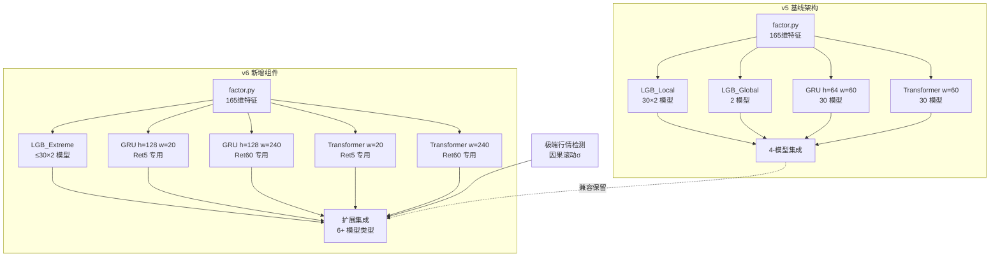
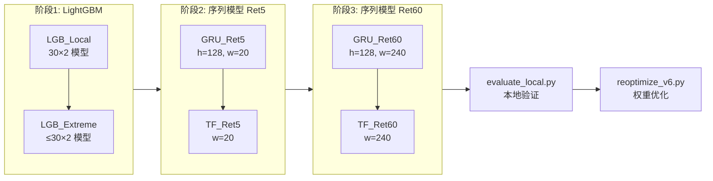
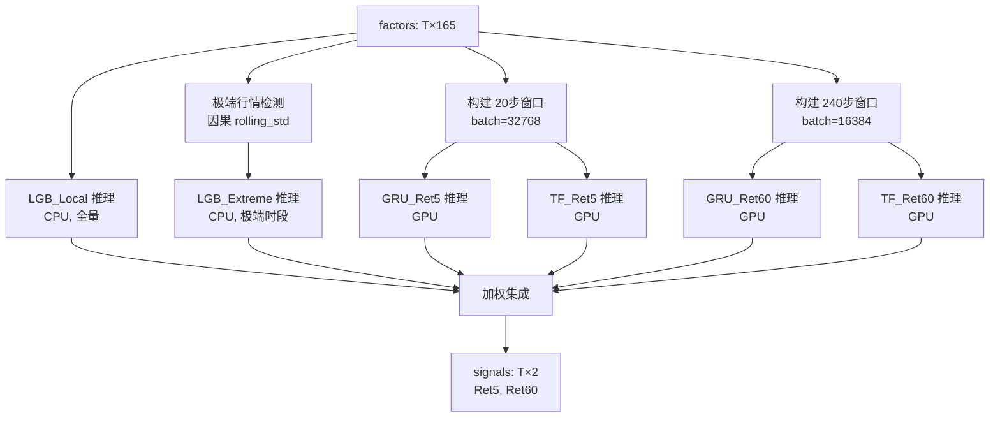

# 设计文档：模型优化 v6

## 概述

v6 在 v5 代码基础上进行五个方向的优化，目标是提升 IC 评测指标（特别是极端行情 eR5/eR60），同时严格遵守推理环境约束（RTX 4090 24GB、60分钟、150MB 提交包）。

**核心改动**：
- `train.py`：IC-aware 损失函数、GRU h=128、双窗口训练、极端行情 LGB 训练、断点续训
- `predict.py`：双窗口推理、极端行情检测与融合、动态 batch 选择、v5 兼容回退
- `reoptimize_v6.py`（新增）：迭代权重优化脚本
- `evaluate_local.py`：支持 v6 所有新模型类型

**不改动**：
- `factor.py`：特征生成完全不变（165维）
- 推理环境硬件约束：RTX 4090 24GB / 80GB RAM / 60 min / 150 MB

**v5 → v6 变更摘要**：

| 维度 | v5 | v6 |
|------|-----|-----|
| 损失函数 | MSE | α·Pearson_Loss + (1-α)·ListMLE, α=0.5 |
| GRU 容量 | h=64, l=2 | h=128, l=2 |
| 窗口策略 | 统一 w=60 | Ret5: w=20, Ret60: w=240 |
| 极端行情 | 无专用模型 | LGB_Extreme（仅极端样本训练） |
| 权重优化 | 训练时一次性确定 | 支持多次迭代优化 |
| 提交包 | ~99 MB | ~144 MB（含极端模型+序列模型） |

---

## 架构

### v6 如何扩展 v5



### 训练流水线（H20 96GB）



### 推理流水线（RTX 4090 24GB）



---

## 组件与接口

### 组件1：IC-aware 损失函数

**目标**：替代 MSE，直接优化评测指标 IC。

#### Pearson Correlation Loss

```python
def pearson_correlation_loss(pred: Tensor, target: Tensor, mask: Tensor) -> Tensor:
    """
    计算 1 - pearson_correlation(pred, target)。
    
    Args:
        pred: (batch_size,) 预测值
        target: (batch_size,) 目标值
        mask: (batch_size,) bool, True 表示有效样本（非 NaN）
    
    Returns:
        标量 loss。当有效样本 < 32 或目标方差为零时返回 0.0。
    """
```

**数学公式**：
```
loss = 1 - (Σ(p_i - p̄)(t_i - t̄)) / (√(Σ(p_i - p̄)²) · √(Σ(t_i - t̄)²))
```

#### ListMLE Loss

```python
def listmle_loss(pred: Tensor, target: Tensor, mask: Tensor) -> Tensor:
    """
    基于 Plackett-Luce 模型的列表级排序损失。
    
    按 target 降序排列，计算：
    loss = -Σ_i [pred_π(i) - log(Σ_{j>=i} exp(pred_π(j)))]
    
    Args:
        pred: (batch_size,) 预测分数
        target: (batch_size,) 真实排序依据
        mask: (batch_size,) bool, 有效样本掩码
    
    Returns:
        标量 loss。有效样本 < 32 时返回 0.0。
    """
```

#### 组合损失

```python
def ic_aware_loss(pred, target, mask, alpha=0.5):
    """loss = α * pearson_loss + (1-α) * listmle_loss"""
    p_loss = pearson_correlation_loss(pred, target, mask)
    l_loss = listmle_loss(pred, target, mask)
    return alpha * p_loss + (1 - alpha) * l_loss
```

#### 训练配置变更

| 参数 | v5 值 | v6 值（IC-aware） | 说明 |
|------|-------|-------------------|------|
| `LOSS_TYPE` | "mse" | "ic_aware" | 可切换回 MSE |
| `GRU_LR` | 1e-3 | 5e-4 | 降低 50%，IC loss 梯度波动大 |
| `TRANSFORMER_LR` | 1e-3 | 5e-4 | 同上 |
| `GRAD_CLIP_MAX_NORM` | 无 | 1.0 | 梯度裁剪 |
| `IC_LOSS_ALPHA` | - | 0.5 | Pearson 与 ListMLE 权重 |
| `IC_LOSS_MIN_SAMPLES` | - | 32 | 批次最少有效样本数 |

---

### 组件2：更大容量 GRU

**变更**：`hidden_size` 64 → 128，其余不变。

| 参数 | v5 | v6 |
|------|-----|-----|
| `GRU_HIDDEN_SIZE` | 64 | 128 |
| `GRU_NUM_LAYERS` | 2 | 2（不变） |
| `GRU_DROPOUT` | 0.1 | 0.1（不变） |

**参数量估算**：
- 输入层：3 × (165×128 + 128×128 + 128×2) = 3 × (21120 + 16384 + 256) ≈ 113K
- 第二层：3 × (128×128 + 128×128 + 128×2) = 3 × (16384 + 16384 + 256) ≈ 99K
- 输出层：128×2 + 2 = 258
- **总计**：~212K 参数 ≈ 0.85 MB（float32）

**Checkpoint 格式**：
```python
{
    "state_dict": model.state_dict(),
    "input_size": 165,
    "hidden_size": 128,      # v6 新增，v5 为 64
    "num_layers": 2,
    "dropout": 0.1,
    "window_size": 20,       # 或 240，取决于目标
    "model_type": "gru",
}
```

**推理兼容**：`predict.py` 从 checkpoint 读取 `hidden_size`，缺失时默认 64（兼容 v5）。

---

### 组件3：双窗口策略

**设计理念**：Ret5（5分钟收益）需要短期微观结构信息（20步 ≈ 20分钟），Ret60（60分钟收益）需要长期趋势信息（240步 ≈ 4小时）。

#### 训练侧

每个数据集训练 4 个序列模型（v5 为 2 个）：

| 模型 | 窗口 | 目标 | 文件名 |
|------|------|------|--------|
| GRU_Ret5 | 20 | Ret5 only | `gru_ret5_{dataset}.pt` |
| GRU_Ret60 | 240 | Ret60 only | `gru_ret60_{dataset}.pt` |
| TF_Ret5 | 20 | Ret5 only | `transformer_ret5_{dataset}.pt` |
| TF_Ret60 | 240 | Ret60 only | `transformer_ret60_{dataset}.pt` |

**注意**：v6 序列模型输出维度从 2 变为 1（每个模型只预测一个目标），简化训练目标。

#### 推理侧

```python
# Ret5 预测
gru_ret5_pred = run_model("gru_ret5_{ds}.pt", window=20, batch=32768)
tf_ret5_pred  = run_model("transformer_ret5_{ds}.pt", window=20, batch=32768)

# Ret60 预测
gru_ret60_pred = run_model("gru_ret60_{ds}.pt", window=240, batch=16384)
tf_ret60_pred  = run_model("transformer_ret60_{ds}.pt", window=240, batch=16384)
```

**短数据集处理**：当 `T < 240` 时，Ret60 序列模型输出全零，仅使用 LGB 预测。

---

### 组件4：极端行情专用 LightGBM

#### 极端行情检测（因果）

```python
def detect_extreme_regime(close_prices: np.ndarray, window: int = 60, 
                          threshold_mult: float = 2.0) -> np.ndarray:
    """
    因果极端行情检测。仅使用 t 时刻之前的数据。
    
    算法：
    1. 计算 close-to-close log return
    2. 计算 rolling_std(return, window=60)（仅用历史数据）
    3. 当 |current_return| > 2 * rolling_std 时标记为极端
    
    Returns:
        (T,) bool array, True = 极端行情
    """
```

#### 训练逻辑

```python
# 仅使用极端样本训练
extreme_mask = detect_extreme_regime(close_prices)
if extreme_mask.sum() < 1000:
    print(f"  Skip LGB_Extreme: only {extreme_mask.sum()} extreme samples")
    return None

X_extreme = features[extreme_mask]
y_extreme = labels[extreme_mask]
# 使用 IC 早停，max 500 rounds
model = train_lgb_two_phase(params, train_data, val_data, max_boost_round=500)
```

#### 推理融合

```python
# 推理时的极端行情融合
extreme_indicator = detect_extreme_regime(close_prices)  # 因果检测
pred_ret5 = (w_local * lgb_local_r5 + w_global * lgb_global_r5 +
             w_gru_ret5 * gru_ret5 + w_tf_ret5 * tf_ret5 +
             w_extreme * extreme_indicator * lgb_extreme_r5)
```

---

### 组件5：迭代权重优化（reoptimize_v6.py）

#### 接口

```bash
# 本地验证集优化
python reoptimize_v6.py --mode local --models-dir models/ --output ensemble_weights.json

# 平台反馈迭代
python reoptimize_v6.py --mode feedback --feedback-dir feedback_state/ --output ensemble_weights.json

# 裁剪零权重模型
python reoptimize_v6.py --mode local --prune --output ensemble_weights.json
```

#### 权重格式（v6 扩展）

```json
{
  "dataset0": {
    "ret5_w_local": 0.45,
    "ret5_w_global": 0.0,
    "ret5_w_gru_ret5": 0.25,
    "ret5_w_tf_ret5": 0.15,
    "ret5_w_extreme": 0.15,
    "ret60_w_local": 0.40,
    "ret60_w_global": 0.0,
    "ret60_w_gru_ret60": 0.30,
    "ret60_w_tf_ret60": 0.20,
    "ret60_w_extreme": 0.10
  }
}
```

**约束**：
- 所有权重 ≥ 0
- `ret5_w_local + ret5_w_global + ret5_w_gru_ret5 + ret5_w_tf_ret5 + ret5_w_extreme = 1.0`
- `ret60_w_local + ret60_w_global + ret60_w_gru_ret60 + ret60_w_tf_ret60 + ret60_w_extreme = 1.0`

**向后兼容**：v5 格式字段（`ret5_w_gru`, `ret5_w_tf`）仍可识别，映射到对应的 v6 字段。

---

## 数据模型

### 文件命名规范

| 模型类型 | 文件名格式 | 数量 | 单文件大小 |
|----------|-----------|------|-----------|
| LGB_Local Ret5 | `lgb_ret5_dataset{i}.txt` | 30 | ~1.6 MB |
| LGB_Local Ret60 | `lgb_ret60_dataset{i}.txt` | 30 | ~1.6 MB |
| LGB_Extreme Ret5 | `lgb_extreme_ret5_dataset{i}.txt` | ≤30 | ~500 KB |
| LGB_Extreme Ret60 | `lgb_extreme_ret60_dataset{i}.txt` | ≤30 | ~500 KB |
| GRU_Ret5 | `gru_ret5_dataset{i}.pt` | 30 | ~1.0 MB |
| GRU_Ret60 | `gru_ret60_dataset{i}.pt` | 30 | ~1.0 MB |
| Transformer_Ret5 | `transformer_ret5_dataset{i}.pt` | 30 | ~0.9 MB |
| Transformer_Ret60 | `transformer_ret60_dataset{i}.pt` | 30 | ~0.9 MB |
| 集成权重 | `ensemble_weights.json` | 1 | ~10 KB |
| 提交清单 | `submission_manifest.json` | 1 | ~5 KB |

### 提交包大小预算

| 组件 | 大小估算 | 说明 |
|------|---------|------|
| LGB_Local（60 模型） | ~99 MB | 与 v5 相同 |
| LGB_Extreme（≤60 模型） | ~30 MB | 500轮×极端样本，较小 |
| 选中的 GRU/TF 模型 | ~15 MB | 通过 --prune 裁剪 |
| 代码 + 配置 | ~1 MB | predict.py, factor.py 等 |
| **总计** | **~144 MB** | 余量 6 MB |

### Checkpoint 元数据结构

```python
# GRU checkpoint
{
    "state_dict": OrderedDict,
    "input_size": int,        # 165
    "hidden_size": int,       # 128 (v6) or 64 (v5)
    "num_layers": int,        # 2
    "dropout": float,         # 0.1
    "window_size": int,       # 20 or 240
    "model_type": "gru",
    "target": str,            # "ret5" or "ret60" (v6 新增)
}

# Transformer checkpoint
{
    "state_dict": OrderedDict,
    "input_size": int,        # 165
    "d_model": int,           # 64
    "nhead": int,             # 4
    "num_layers": int,        # 4
    "dim_feedforward": int,   # 256
    "dropout": float,         # 0.1
    "window_size": int,       # 20 or 240
    "model_type": "transformer",
    "target": str,            # "ret5" or "ret60" (v6 新增)
}
```

---

## 资源估算

### H20 训练环境（96GB VRAM / 150GB RAM）

| 训练阶段 | GPU 显存峰值 | 系统内存峰值 | 预估时间 |
|----------|-------------|-------------|---------|
| LGB_Local（30×2） | 0 GB | ~77 GB | ~4 h |
| LGB_Extreme（≤30×2） | 0 GB | ~30 GB | ~1 h |
| GRU_Ret5（30×, w=20, h=128） | ~12 GB | ~20 GB | ~6 h |
| GRU_Ret60（30×, w=240, h=128） | ~25 GB | ~25 GB | ~12 h |
| TF_Ret5（30×, w=20） | ~15 GB | ~20 GB | ~6 h |
| TF_Ret60（30×, w=240） | ~35 GB | ~25 GB | ~12 h |
| **峰值** | **~35 GB / 96 GB (36%)** | **~77 GB / 150 GB (51%)** | **~41 h** |

**显存明细（GRU_Ret60 单 batch）**：
- 输入张量：16384 × 240 × 165 × 4B = 2.5 GB
- 模型参数：~0.85 MB
- 梯度 + 优化器状态：~2.5 MB
- 中间激活（AMP off）：~3 GB
- 验证集预加载：~8 GB（最大数据集）
- **单模型峰值**：~14 GB

### RTX 4090 推理环境（24GB VRAM / 80GB RAM）

| 推理阶段 | GPU 显存峰值 | 时间估算 |
|----------|-------------|---------|
| LGB 推理（CPU） | 0 GB | ~2 min |
| GRU_Ret5（w=20, batch=32768） | ~4 GB | ~1 min |
| TF_Ret5（w=20, batch=32768） | ~4 GB | ~1 min |
| GRU_Ret60（w=240, batch=16384） | ~5 GB | ~3 min |
| TF_Ret60（w=240, batch=16384） | ~6 GB | ~4 min |
| **峰值（单模型）** | **~6 GB / 24 GB (25%)** | **~11 min 总计** |

**注意**：序列模型逐个推理，每个完成后释放 GPU 资源，不会叠加。

---

## 正确性属性

*正确性属性是在系统所有有效执行中都应成立的特征或行为——本质上是对系统应做什么的形式化陈述。属性是人类可读规范与机器可验证正确性保证之间的桥梁。*

### 属性1：损失函数数学正确性

*对任意* 批次的预测值 pred 和目标值 target（均为有效浮点数，长度 ≥ 32），组合损失 `ic_aware_loss(pred, target, α)` 应等于 `α * (1 - pearson_corr(pred, target)) + (1-α) * listmle(pred, target)`，其中 pearson_corr 和 listmle 分别按标准公式计算。

**验证：需求 1.1、1.2、1.3**

### 属性2：NaN 安全损失计算

*对任意* 包含 NaN 值的批次，损失函数应仅在非 NaN 样本上计算；当非 NaN 样本数少于 32 时，损失应返回 0.0；当目标方差为零时，Pearson 损失应返回 0.0 而非产生 NaN/Inf。

**验证：需求 1.4、1.8**

### 属性3：双窗口模型路由正确性

*对任意* 数据集和预测目标，推理流水线应满足：Ret5 预测仅使用 `*_ret5_*` 模型文件和 20 步窗口，Ret60 预测仅使用 `*_ret60_*` 模型文件和 240 步窗口。窗口构建的输出形状应分别为 `(batch, 20, 165)` 和 `(batch, 240, 165)`。

**验证：需求 3.3、3.4、3.5**

### 属性4：短数据集安全降级

*对任意* 长度小于 240 行的数据集，Ret60 序列模型（GRU_Ret60、TF_Ret60）的输出应为全零向量，最终 Ret60 预测仅由 LightGBM 模型贡献。

**验证：需求 3.7**

### 属性5：极端行情样本过滤正确性

*对任意* 收益率序列和对应的 close 价格序列，极端行情掩码应精确标记满足 `|ret[t]| > 2 * rolling_std(ret[0:t], window=60)` 的时刻，且 LGB_Extreme 训练集应仅包含被标记为极端的样本。

**验证：需求 4.1、4.2**

### 属性6：因果极端行情推理

*对任意* 时间序列，推理时的极端行情检测在时刻 t 的输出应仅依赖于 t 之前（含 t）的数据，不引入未来信息。且极端模型预测应以 `w_extreme * extreme_indicator` 的权重正确融合到最终预测中。

**验证：需求 4.4、4.5**

### 属性7：极端训练跳过阈值

*对任意* 数据集，当极端行情样本数少于 1000 条时，训练流水线应跳过该数据集的 LGB_Extreme 训练，不生成对应的模型文件。

**验证：需求 4.7**

### 属性8：权重约束验证

*对任意* 由 reoptimize_v6.py 输出的权重配置，所有权重值应 ≥ 0，且同一预测目标（Ret5 或 Ret60）的所有权重之和应等于 1.0。

**验证：需求 5.4**

### 属性9：提交包自动裁剪

*对任意* 模型文件集合，当总大小超过 144 MB 时，裁剪逻辑应按权重从低到高移除序列模型文件，直到总大小降至 144 MB 以下，且不移除 LightGBM 模型。

**验证：需求 6.4**

### 属性10：自适应 Batch 大小选择

*对任意* 推理场景，窗口大小为 20 时 batch_size 应为 32768，窗口大小为 240 时 batch_size 应为 16384；当可用 GPU 显存低于 8 GB 时，batch_size 应自动减半。

**验证：需求 8.2、8.5**

### 属性11：向后兼容与优雅降级

*对任意* 数据集，当 v6 模型文件（`gru_ret5_*.pt`）不存在时，推理应回退到 v5 模型文件（`gru_*.pt`）；当极端模型文件不存在时，极端权重应视为 0；当任何模型加载失败时，该模型输出应为零向量且不中断整体推理；v5 格式的权重 JSON 应被正确解析。

**验证：需求 10.1、10.2、10.3、10.4、10.5**

### 属性12：OOM 恢复机制

*对任意* 训练过程中发生的 GPU OOM 错误，训练流水线应自动将 batch_size 减半并重试，最多重试 2 次。若 3 次均失败，应记录错误并跳过该模型。

**验证：需求 9.6**

### 属性13：断点续训正确性

*对任意* 中断后重启的训练过程，已完成的模型（checkpoint 文件已存在）应被跳过，从中断点继续训练未完成的模型。

**验证：需求 12.2**

### 属性14：大数据集序列模型跳过

*对任意* 行数超过 3,000,000 且序列模型最大权重 ≤ 0.2 的数据集，推理流水线应跳过所有序列模型推理，仅使用 LightGBM 预测。

**验证：需求 7.3**

---

## 错误处理

| 场景 | 处理方式 | 影响范围 |
|------|---------|---------|
| IC-aware loss 产生 NaN（目标方差为零） | 返回 loss=0.0，跳过该批次梯度更新 | 单批次 |
| IC-aware loss 批次有效样本 < 32 | 返回 loss=0.0，跳过该批次 | 单批次 |
| GRU/TF 训练 GPU OOM | batch_size 减半重试，最多 2 次 | 单模型 |
| 极端样本不足 1000 条 | 跳过 LGB_Extreme 训练，不生成文件 | 单数据集 |
| 推理时模型文件不存在 | 回退到 v5 模型或输出零向量 | 单模型 |
| 推理时模型加载失败（文件损坏） | 输出警告日志 + 零向量，不中断 | 单模型 |
| 推理时 GPU 显存不足 | batch_size 减半 | 单模型 |
| 数据集长度 < 240 | Ret60 序列模型输出零向量 | 单数据集 |
| 提交包超过 144 MB | 自动裁剪低权重序列模型 | 全局 |
| 提交包超过 150 MB | 报错终止，要求手动干预 | 全局 |
| 训练中断（进程被杀） | 断点续训跳过已完成模型 | 全局 |
| 权重优化产生非法值 | 裁剪到 [0, 1] 并重新归一化 | 单数据集 |
| ListMLE 数值溢出（exp 过大） | 使用 log-sum-exp trick 稳定计算 | 单批次 |
| AMP 产生 NaN loss | GradScaler 自动跳过该 step | 单批次 |

---

## 测试策略

### 属性测试（Property-Based Testing）

使用 **Hypothesis**（Python PBT 库）实现正确性属性验证。每个属性测试运行 **最少 100 次迭代**。

**测试文件**：`tests/test_v6_properties.py`

| 属性 | 测试方法 | 生成器 |
|------|---------|--------|
| 属性1：损失函数正确性 | 生成随机 pred/target 张量，对比参考实现 | `st.floats` + `st.lists` |
| 属性2：NaN 安全 | 生成含随机 NaN 模式的批次 | `st.floats(allow_nan=True)` |
| 属性3：双窗口路由 | 生成随机数据集名和目标，验证文件路径和窗口形状 | `st.sampled_from(["ret5","ret60"])` |
| 属性5：极端过滤 | 生成随机收益率序列，验证掩码正确性 | `st.floats` 序列 |
| 属性6：因果性 | 生成时间序列，验证 t 时刻输出不依赖 t+1 数据 | `st.lists(st.floats)` |
| 属性8：权重约束 | 生成随机权重向量，验证归一化 | `st.floats(min=0, max=1)` |
| 属性10：Batch 选择 | 生成随机窗口大小和 VRAM 值 | `st.integers` + `st.floats` |
| 属性11：兼容性 | 生成 v5/v6 格式 checkpoint，验证加载 | 自定义 checkpoint 生成器 |

**标签格式**：
```python
# Feature: model-optimization-v6, Property 1: 损失函数数学正确性
@given(...)
@settings(max_examples=100)
def test_loss_function_correctness(...):
    ...
```

### 单元测试（Example-Based）

| 测试项 | 验证内容 |
|--------|---------|
| GRU checkpoint 大小 | 构建 h=128 模型，保存，验证 < 1.5 MB |
| Transformer checkpoint 大小 | 构建标准模型，保存，验证 < 1.0 MB |
| 文件命名规范 | 验证训练输出文件名匹配预期模式 |
| LOSS_TYPE 切换 | 验证 "mse" 使用 MSELoss，"ic_aware" 使用组合损失 |
| 学习率配置 | 验证 IC-aware 模式下 lr = 5e-4 |
| 训练顺序 | 验证日志中模型训练顺序正确 |

### 集成测试

| 测试项 | 验证内容 |
|--------|---------|
| 端到端训练（小数据集） | 在 1000 行合成数据上运行完整训练流水线 |
| 端到端推理 | 加载训练产出，运行 predict.py，验证输出形状和有限性 |
| v5 → v6 兼容 | 使用 v5 模型文件运行 v6 predict.py |
| 提交包大小 | 训练后验证总大小 < 150 MB |
| 推理时间 | 在目标硬件上验证 < 60 min |

### 测试配置

```python
# pytest.ini / pyproject.toml
[tool.pytest.ini_options]
markers = [
    "property: Property-based tests (min 100 iterations)",
    "unit: Example-based unit tests",
    "integration: End-to-end integration tests",
    "slow: Tests requiring GPU or large data",
]
```
